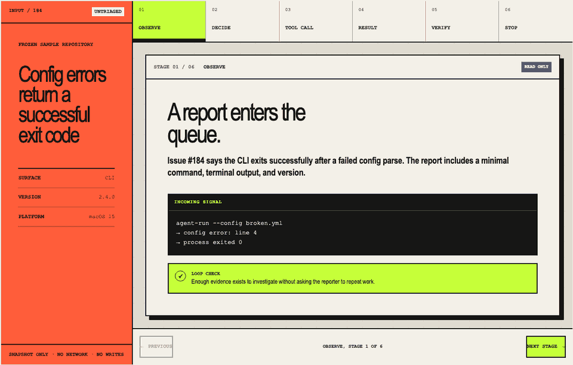

# Progress

**Current phase:** Phase 2 — Foundations and reference-agent skeleton (in progress)

**Current schedule week:** Week 2 (`floor((2026-08-07 − 2026-07-25) / 7) + 1`)

**Last completed unit:** Phase 2 first read-only reference-agent capability — DONE

**Next unit:** Phase 2 example, citation, testing, and versioning conventions — add one concise conventions contract for later modules and reference-agent examples, with an executable audit that checks the already-shipped Phase 2 artifacts; do not revise DONE pages or agent behavior

## State note

`PROGRESS.md` and `DECISIONS.md` were absent at the start of the first run. The repository contained only an untracked `SCHEDULE.md` and had no local commits. The schedule says Phase 0 is closed and implementation is active, so this ledger begins at Phase 1.

## Schedule drift

- The site is public in Week 1 at `https://building-agent-systems-lab.tsa29.chatgpt.site`, resolving the prior publication drift.
- The selected Sites host stores independently deployable saved versions, but its available deployment control exposes no separate preview URL (`current_preview_url: null`). Preview URLs remain schedule drift rather than a completion claim.
- Phase 2 content work began during schedule Week 2, five days before its planned August 8 start. This is additive progress; Phase 1 exit criteria remain met.

## Run reports

### 2026-07-24 — Phase 1 site skeleton

**Phase and unit completed**

- Phase 1 — Spine and flagship lab
- Unit: static Astro site skeleton, routing, React/MDX integration points, Tailwind design tokens, local content collection, WIP front door, accessible 404, and verification harness
- Schedule week: Week 0

**Verification output**

`pnpm build && pnpm typecheck`

```text
$ ASTRO_TELEMETRY_DISABLED=1 astro build
18:28:15 [content] Syncing content
18:28:15 [content] Synced content
18:28:15 [types] Generated 169ms
18:28:15 [build] output: "static"
18:28:15 [build] mode: "static"
18:28:15 [build] directory: /Users/Panda/Desktop/Daily/Github Research/BuildingAgentSystems/dist/
18:28:15 [build] Collecting build info...
18:28:15 [build] ✓ Completed in 179ms.
18:28:15 [build] Building static entrypoints...
18:28:15 [vite] ✓ built in 82ms
18:28:15 [vite] ✓ built in 38ms
18:28:15 [build] Rearranging server assets...

 generating static routes
18:28:15   ├─ /404.html (+4ms)
18:28:15   ├─ /index.html (+1ms)
18:28:15 ✓ Completed in 18ms.

18:28:15 [build] ✓ Completed in 150ms.
18:28:15 [build] 2 page(s) built in 330ms
18:28:15 [build] Complete!
$ ASTRO_TELEMETRY_DISABLED=1 astro check
18:28:16 [content] Syncing content
18:28:16 [content] Synced content
18:28:16 [types] Generated 166ms
18:28:16 [check] Getting diagnostics for Astro files in /Users/Panda/Desktop/Daily/Github Research/BuildingAgentSystems...
Result (10 files):
- 0 errors
- 0 warnings
- 0 hints
```

`pnpm test:smoke`

```text
$ playwright test tests/smoke.spec.ts
Running 3 tests using 3 workers
[1/3] tests/smoke.spec.ts:44:1 › small-screen layout keeps the primary path available
[2/3] tests/smoke.spec.ts:24:1 › reduced motion removes the status loop
[3/3] tests/smoke.spec.ts:3:1 › front door renders and works from the keyboard
  3 passed (517ms)
```

The keyboard test exercises the skip link and primary in-page path. The reduced-motion test emulates `prefers-reduced-motion: reduce` and asserts the status animation is reduced to one iteration at no more than `0.00001s`. The resulting full-page render at `test-results/reduced-motion.png` was manually inspected: layout and content remain intact, the status marker is static, and the browser console contains zero errors.

`pnpm test:a11y`

```text
$ playwright test tests/accessibility.spec.ts
Running 2 tests using 2 workers
[1/2] tests/accessibility.spec.ts:17:1 › front door passes axe color contrast
[2/2] tests/accessibility.spec.ts:4:1 › front door has no serious or critical axe violations
  2 passed (1.5s)
```

`pnpm test:links`

```text
$ linkinator dist --recurse
→ crawling dist
[200] dist
[200] dist/_astro/BaseLayout.B56amoVj.css

dist
  [200] dist
  [200] dist/_astro/BaseLayout.B56amoVj.css
✓ Successfully scanned 2 links in 0.021 seconds.
```

Internal hash destinations are additionally exercised by the keyboard smoke test.

Lighthouse against `http://127.0.0.1:4321/`

```text
performance: 100
accessibility: 100
FCP: 0.8 s
LCP: 0.8 s
CLS: 0
```

`docs/sources.md` now records primary official URLs and `verified: 2026-07-24` dates for the Astro integrations, Tailwind Vite integration, content collection loader, and Motion package conventions used in this unit.

```text
200 https://docs.astro.build/en/guides/integrations/
200 https://docs.astro.build/en/guides/styling/#tailwind
200 https://docs.astro.build/en/guides/content-collections/
200 https://motion.dev/docs/react-installation
```

**Decisions made this run**

- Restored the missing progress and decision ledgers during the first implementation unit.
- Selected Tailwind CSS 4 through its official Vite plugin.
- Kept the front door static with zero client JavaScript; React islands and Motion remain available for labs that need them.
- Deferred hosting and publication until explicit remote-mutation review.

**Remaining uncertainty**

- The static host and public preview URL are not configured. This is intentional pending explicit approval for remote mutation.
- Art direction is strong enough for the first shell but is not marked as the separate locked-art-direction deliverable.

**Single next unit**

Agent loop simulator — implement the standalone step-through observation → decision → tool call → result → verification flow using the frozen issue-triage trace, including keyboard controls, reduced-motion behavior, and a non-interactive textual equivalent.

### 2026-07-25 — Agent loop simulator

**Phase and unit completed**

- Phase 1 — Spine and flagship lab
- Unit: standalone agent loop simulator at `/labs/agent-loop/`
- Shipped one frozen issue-triage trace with separate observation, decision, tool call, result, verification, and stop stages; read-only evidence; a visible approval boundary; arrow-key tab traversal; previous/next controls; a server-rendered text equivalent; responsive layouts; and reduced-motion behavior
- Schedule week: Week 1

**Verification output**

`pnpm build && pnpm typecheck`

```text
$ ASTRO_TELEMETRY_DISABLED=1 astro build
18:06:55 [content] Syncing content
18:06:55 [content] Synced content
18:06:55 [types] Generated 163ms
18:06:55 [build] output: "static"
18:06:55 [build] mode: "static"
18:06:55 [build] directory: /Users/Panda/Desktop/Daily/Github Research/BuildingAgentSystems/dist/
18:06:55 [build] Collecting build info...
18:06:55 [build] ✓ Completed in 175ms.
18:06:55 [build] Building static entrypoints...
18:06:55 [vite] ✓ built in 94ms
18:06:55 [vite] ✓ built in 46ms
18:06:55 [build] Rearranging server assets...

 generating static routes
18:06:55   ├─ /404.html (+4ms)
18:06:55   ├─ /labs/agent-loop/index.html (+46ms)
18:06:55   ├─ /index.html (+1ms)
18:06:55 ✓ Completed in 63ms.

18:06:55 [build] ✓ Completed in 214ms.
18:06:55 [build] 3 page(s) built in 391ms
18:06:55 [build] Complete!
$ ASTRO_TELEMETRY_DISABLED=1 astro check
18:06:56 [content] Syncing content
18:06:56 [content] Synced content
18:06:56 [types] Generated 164ms
18:06:56 [check] Getting diagnostics for Astro files in /Users/Panda/Desktop/Daily/Github Research/BuildingAgentSystems...
Result (13 files):
- 0 errors
- 0 warnings
- 0 hints
```

`pnpm test:smoke`

```text
Running 3 tests using 3 workers
[1/3] tests/smoke.spec.ts:44:1 › small-screen layout keeps the primary path available
[2/3] tests/smoke.spec.ts:3:1 › front door renders and works from the keyboard
[3/3] tests/smoke.spec.ts:24:1 › reduced motion removes the status loop
  3 passed (1.3s)
```

`pnpm exec playwright test tests/agent-loop.spec.ts`

```text
Running 4 tests using 4 workers
[1/4] tests/agent-loop.spec.ts:42:1 › agent loop has a complete textual equivalent
[2/4] tests/agent-loop.spec.ts:3:1 › agent loop completes with keyboard-only controls
[3/4] tests/agent-loop.spec.ts:85:1 › agent loop remains usable on a small screen
[4/4] tests/agent-loop.spec.ts:51:1 › agent loop honors reduced motion
  4 passed (2.2s)
```

The keyboard-only test traverses the stage tabs with Arrow Right, End, and Home, then activates the next-stage control with Enter. The reduced-motion test emulates `prefers-reduced-motion: reduce`, asserts the status animation is `none`, and confirms the changing panel has no transform or transition duration.

`pnpm test:a11y`

```text
Running 4 tests using 4 workers
[1/4] tests/accessibility.spec.ts:4:1 › front door has no serious or critical axe violations
[2/4] tests/accessibility.spec.ts:17:1 › front door passes axe color contrast
[3/4] tests/accessibility.spec.ts:40:1 › agent loop passes axe color contrast
[4/4] tests/accessibility.spec.ts:27:1 › agent loop has no serious or critical axe violations
  4 passed (1.6s)
```

The full-page renders at `test-results/agent-loop-reduced-motion.png` and `test-results/agent-loop-mobile.png` were manually inspected. The reduced-motion render retains the complete content hierarchy with a static status marker and instant stage change; the 360 px render keeps all controls readable, preserves the evidence chain, and has no horizontal overflow.

Lighthouse against `http://127.0.0.1:4321/labs/agent-loop/`

```text
performance: 100
accessibility: 100
FCP: 1.2 s
LCP: 1.7 s
CLS: 0
```

Route-specific link crawl:

```text
→ crawling http://127.0.0.1:4321/labs/agent-loop/
[200] http://127.0.0.1:4321/labs/agent-loop/
[200] http://127.0.0.1:4321/_astro/BaseLayout.DHDLG_07.css
[200] http://127.0.0.1:4321/_astro/agent-loop.SotwMiDj.css
[200] http://127.0.0.1:4321/
✓ Successfully scanned 4 links in 0.021 seconds.
```

`docs/sources.md` records the primary source for the loop, environmental feedback, human checkpoint, and stopping-condition claims with a `verified: 2026-07-25` stamp.

```text
200 https://www.anthropic.com/engineering/building-effective-agents
```

**Decisions made this run**

- Model the flagship trace as six distinct stages, keeping tool result, verification, and stop separate so the evidence chain is inspectable.
- End at a proposal-only state; applying labels remains a consequential action behind an approval boundary.
- Ship the entire trace as server-rendered HTML behind a native disclosure so the lesson works without client JavaScript.

**Remaining uncertainty**

- The completed standalone route is not linked from the frozen homepage because front-door integration is a separate unit.
- The static host and public preview URL remain unconfigured; external deployment still requires explicit review.
- The art direction is demonstrated by the shell and flagship lab but has not yet been marked as its separate locked deliverable.

**Commit hash and push status**

- Unit commit: `f8662ec` (`feat(lab): ship agent loop simulator`)
- Push: successful ordinary non-force push to the verified canonical `origin/main` (`bc45924..f8662ec`)

**Single next unit**

Flagship front-door integration — explicitly revise the frozen homepage CTA and first-lab placeholder so they link to the completed `/labs/agent-loop/` experience, then verify the changed homepage and cross-route path.

### 2026-07-26 — Flagship front-door integration

**Phase and unit completed**

- Phase 1 — Spine and flagship lab
- Unit: flagship front-door integration from `/` to `/labs/agent-loop/`
- Replaced the stale hero placeholder with a direct lab CTA, added a direct CTA to the lab preview, linked the primary-navigation entry, and updated the WIP copy to state that the flagship lab is live
- Added keyboard-only cross-route smoke coverage and a 360 px visual evidence capture
- Schedule week: Week 1

**Verification output**

`pnpm build && pnpm typecheck`

```text
$ ASTRO_TELEMETRY_DISABLED=1 astro build
18:02:22 [content] Syncing content
18:02:22 [content] Synced content
18:02:22 [types] Generated 172ms
18:02:22 [build] output: "static"
18:02:22 [build] mode: "static"
18:02:22 [build] directory: /Users/Panda/Desktop/Daily/Github Research/BuildingAgentSystems/dist/
18:02:22 [build] Collecting build info...
18:02:22 [build] ✓ Completed in 183ms.
18:02:22 [build] Building static entrypoints...
18:02:22 [vite] ✓ built in 108ms
18:02:22 [vite] ✓ built in 54ms
18:02:22 [build] Rearranging server assets...

 generating static routes
18:02:22   ├─ /404.html (+5ms)
18:02:22   ├─ /labs/agent-loop/index.html (+47ms)
18:02:22   ├─ /index.html (+1ms)
18:02:22 ✓ Completed in 65ms.

18:02:22 [build] ✓ Completed in 238ms.
18:02:22 [build] 3 page(s) built in 423ms
18:02:22 [build] Complete!
$ ASTRO_TELEMETRY_DISABLED=1 astro check
18:02:23 [content] Syncing content
18:02:23 [content] Synced content
18:02:23 [types] Generated 170ms
18:02:23 [check] Getting diagnostics for Astro files in /Users/Panda/Desktop/Daily/Github Research/BuildingAgentSystems...
Result (13 files):
- 0 errors
- 0 warnings
- 0 hints
```

`pnpm test:smoke`

```text
Running 3 tests using 3 workers
[1/3] tests/smoke.spec.ts:49:1 › small-screen layout keeps the primary path available
[2/3] tests/smoke.spec.ts:3:1 › front door renders and works from the keyboard
[3/3] tests/smoke.spec.ts:29:1 › reduced motion removes the status loop
  3 passed (1.4s)
```

The keyboard-only test focuses and activates the hero CTA, confirms navigation to `/labs/agent-loop/`, and verifies the simulator heading. It also asserts that both the hero and preview CTAs point to the completed route.

`pnpm test:a11y`

```text
Running 4 tests using 4 workers
[1/4] tests/accessibility.spec.ts:40:1 › agent loop passes axe color contrast
[2/4] tests/accessibility.spec.ts:27:1 › agent loop has no serious or critical axe violations
[3/4] tests/accessibility.spec.ts:17:1 › front door passes axe color contrast
[4/4] tests/accessibility.spec.ts:4:1 › front door has no serious or critical axe violations
  4 passed (1.7s)
```

Reduced-motion and mobile behavior were manually inspected in the generated full-page renders at `test-results/reduced-motion.png` and `test-results/front-door-mobile.png`. The reduced-motion page retains the complete hierarchy with a static status marker; computed animation duration is no more than `0.00001s` with one iteration. At 360 px, both CTAs remain legible, the preview stacks into one column, and the page has no horizontal overflow.

Lighthouse against `http://127.0.0.1:4321/`

```text
performance: 100
accessibility: 100
FCP: 0.8 s
LCP: 0.9 s
CLS: 0
```

`pnpm test:links`

```text
$ linkinator dist --recurse
→ crawling dist
[200] dist
[200] dist/labs/agent-loop/
[200] dist/_astro/BaseLayout.Vm1UIJon.css
[200] dist/_astro/agent-loop.SotwMiDj.css

  [200] dist
  [200] dist/labs/agent-loop/
  [200] dist/_astro/BaseLayout.Vm1UIJon.css
  [200] dist/_astro/agent-loop.SotwMiDj.css
dist
dist/labs/agent-loop/
✓ Successfully scanned 4 links in 0.022 seconds.
```

This integration adds no technical claims, so `docs/sources.md` requires no new entry.

**Decisions made this run**

- None. The unit implements the next task already fixed by `PROGRESS.md`.

**Remaining uncertainty**

- The static host and public preview URL remain unconfigured because external deployment requires explicit approval.
- The demonstrated art direction is not yet captured as a locked deliverable.

**Commit hash and push status**

- Unit commit: `51651a2` (`feat(site): link flagship lab from home`)
- Push: successful ordinary non-force push to the verified canonical `origin/main` (`b048f5d..51651a2`)

**Single next unit**

Art-direction lock — codify the demonstrated typography, color, illustration, spacing, navigation, and motion vocabulary in `docs/art-direction.md`, then verify both shipped routes against it without restyling DONE work.

### 2026-07-27 — Art-direction lock

**Phase and unit completed**

- Phase 1 — Spine and flagship lab
- Unit: locked the demonstrated editorial-workbench art direction in `docs/art-direction.md`
- Codified typography, core and contextual color roles, illustration language, spacing and responsive rules, navigation, controls, motion, page grammar, content voice, accessibility gates, and extension rules
- Added a route-level Playwright audit covering the guide front door and flagship lab without modifying either DONE route
- Schedule week: Week 1

**Verification output**

`pnpm build && pnpm typecheck`

```text
$ ASTRO_TELEMETRY_DISABLED=1 astro build
18:07:04 [content] Syncing content
18:07:04 [content] Synced content
18:07:04 [types] Generated 214ms
18:07:04 [build] output: "static"
18:07:04 [build] mode: "static"
18:07:04 [build] directory: /Users/Panda/Desktop/Daily/Github Research/BuildingAgentSystems/dist/
18:07:04 [build] Collecting build info...
18:07:04 [build] ✓ Completed in 226ms.
18:07:04 [build] Building static entrypoints...
18:07:04 [vite] ✓ built in 86ms
18:07:04 [vite] ✓ built in 49ms
18:07:04 [build] Rearranging server assets...

 generating static routes
18:07:04   ├─ /404.html (+5ms)
18:07:04   ├─ /labs/agent-loop/index.html (+63ms)
18:07:04   ├─ /index.html (+1ms)
18:07:04 ✓ Completed in 81ms.

18:07:04 [build] ✓ Completed in 231ms.
18:07:04 [build] 3 page(s) built in 458ms
18:07:04 [build] Complete!
$ ASTRO_TELEMETRY_DISABLED=1 astro check
18:07:05 [content] Syncing content
18:07:05 [content] Synced content
18:07:05 [types] Generated 188ms
18:07:05 [check] Getting diagnostics for Astro files in /Users/Panda/Desktop/Daily/Github Research/BuildingAgentSystems...
Result (14 files):
- 0 errors
- 0 warnings
- 0 hints
```

Full Playwright regression, including smoke, keyboard-only operation, art-direction audit, reduced motion, mobile overflow, and axe:

```text
Running 14 tests using 7 workers
[1/14] tests/agent-loop.spec.ts:51:1 › agent loop honors reduced motion
[2/14] tests/agent-loop.spec.ts:42:1 › agent loop has a complete textual equivalent
[3/14] tests/agent-loop.spec.ts:3:1 › agent loop completes with keyboard-only controls
[4/14] tests/accessibility.spec.ts:27:1 › agent loop has no serious or critical axe violations
[5/14] tests/accessibility.spec.ts:40:1 › agent loop passes axe color contrast
[6/14] tests/accessibility.spec.ts:4:1 › front door has no serious or critical axe violations
[7/14] tests/accessibility.spec.ts:17:1 › front door passes axe color contrast
[8/14] tests/agent-loop.spec.ts:85:1 › agent loop remains usable on a small screen
[9/14] tests/art-direction.spec.ts:29:1 › front door conforms to the locked art direction
[10/14] tests/art-direction.spec.ts:121:1 › agent loop conforms to the locked art direction
[11/14] tests/art-direction.spec.ts:198:1 › both routes collapse decorative motion when reduced motion is requested
[12/14] tests/smoke.spec.ts:3:1 › front door renders and works from the keyboard
[13/14] tests/smoke.spec.ts:31:1 › reduced motion removes the status loop
[14/14] tests/smoke.spec.ts:51:1 › small-screen layout keeps the primary path available
  14 passed (2.5s)
```

The reduced-motion renders at `test-results/reduced-motion.png` and `test-results/agent-loop-reduced-motion.png` were manually inspected. Both retain the complete hierarchy and visible state with static status markers and immediate panel changes. The desktop audit captures at `test-results/art-direction-home.png` and `test-results/art-direction-agent-loop.png` conform to the locked composition, type, color, rule, control, and evidence grammar. The 360 px captures at `test-results/front-door-mobile.png` and `test-results/agent-loop-mobile.png` recompose cleanly with no horizontal overflow.

Lighthouse against both audited routes:

```text
test-results/lighthouse-home.json
{
  "performance": 100,
  "accessibility": 100,
  "FCP": "0.8 s",
  "LCP": "0.9 s",
  "CLS": "0"
}
test-results/lighthouse-agent-loop.json
{
  "performance": 100,
  "accessibility": 100,
  "FCP": "0.9 s",
  "LCP": "0.9 s",
  "CLS": "0"
}
```

`pnpm test:links`

```text
$ linkinator dist --recurse
→ crawling dist
[200] dist
[200] dist/labs/agent-loop/
[200] dist/_astro/BaseLayout.Dc1CQ5QZ.css
[200] dist/_astro/agent-loop.SotwMiDj.css

  [200] dist
dist
  [200] dist/labs/agent-loop/
  [200] dist/_astro/BaseLayout.Dc1CQ5QZ.css
dist/labs/agent-loop/
  [200] dist/_astro/agent-loop.SotwMiDj.css
✓ Successfully scanned 4 links in 0.023 seconds.
```

`docs/art-direction.md` contains no external or Markdown links. It records internal design decisions and implemented values rather than new technical claims, so `docs/sources.md` requires no update.

**Decisions made this run**

- Locked the demonstrated editorial-workbench direction as the v1 visual contract: paper and ink construction, hard rules, condensed display type, monospace instrumentation, sparse semantic signal color, CSS-native geometry, and short state-driven motion.
- Added a contract-level computed-style audit instead of screenshot snapshots so future work can preserve the vocabulary while still composing new pages.

**Remaining uncertainty**

- The static host and public preview URL remain unconfigured because external deployment requires explicit approval.
- The README front door cannot yet satisfy its required live URL above the fold. The curriculum outline is the next unblocked Phase 1 unit.

**Commit hash and push status**

- Unit commit: `cb4a0ed` (`docs(design): lock art direction`)
- Metadata-cleanup commit: `3aaec42` (`docs(design): clean art direction metadata`)
- Push: successful ordinary non-force push to the verified canonical `origin/main` (`6e7f1f7..3aaec42`)

**Single next unit**

Phase 1 curriculum outline — create `docs/curriculum-outline.md` as a one-page map of module → reader outcome → signature or light interaction → concrete checkpoint, without drafting module prose.

### 2026-07-28 — Curriculum outline

**Phase and unit completed**

- Phase 1 — Spine and flagship lab
- Unit: v1 curriculum outline in `docs/curriculum-outline.md`
- Mapped all 11 scheduled modules to one reader outcome, their named signature or light interaction, and one observable checkpoint
- Kept the frozen issue-triage agent as the continuous build thread and summarized the artifacts the reader carries forward
- Schedule week: Week 1

**Verification output**

Curriculum structure audit:

```text
curriculum audit: modules=11 interactions=11 checkpoints=11
```

`pnpm build && pnpm typecheck`

```text
$ ASTRO_TELEMETRY_DISABLED=1 astro build
18:02:16 [content] Syncing content
18:02:16 [content] Synced content
18:02:16 [types] Generated 177ms
18:02:16 [build] output: "static"
18:02:16 [build] mode: "static"
18:02:16 [build] directory: /Users/Panda/Desktop/Daily/Github Research/BuildingAgentSystems/dist/
18:02:16 [build] Collecting build info...
18:02:16 [build] ✓ Completed in 195ms.
18:02:16 [build] Building static entrypoints...
18:02:16 [vite] ✓ built in 119ms
18:02:16 [vite] ✓ built in 53ms
18:02:16 [build] Rearranging server assets...

 generating static routes
18:02:16   ├─ /404.html (+6ms)
18:02:16   ├─ /labs/agent-loop/index.html (+49ms)
18:02:16   ├─ /index.html (+1ms)
18:02:16 ✓ Completed in 69ms.

18:02:16 [build] ✓ Completed in 252ms.
18:02:16 [build] 3 page(s) built in 449ms
18:02:16 [build] Complete!
$ ASTRO_TELEMETRY_DISABLED=1 astro check
18:02:17 [content] Syncing content
18:02:17 [content] Synced content
18:02:17 [types] Generated 173ms
18:02:17 [check] Getting diagnostics for Astro files in /Users/Panda/Desktop/Daily/Github Research/BuildingAgentSystems...
Result (14 files):
- 0 errors
- 0 warnings
- 0 hints
```

Full Playwright regression:

```text
Running 14 tests using 7 workers
[1/14] tests/agent-loop.spec.ts:3:1 › agent loop completes with keyboard-only controls
[2/14] tests/agent-loop.spec.ts:51:1 › agent loop honors reduced motion
[3/14] tests/agent-loop.spec.ts:42:1 › agent loop has a complete textual equivalent
[4/14] tests/accessibility.spec.ts:27:1 › agent loop has no serious or critical axe violations
[5/14] tests/accessibility.spec.ts:40:1 › agent loop passes axe color contrast
[6/14] tests/accessibility.spec.ts:4:1 › front door has no serious or critical axe violations
[7/14] tests/accessibility.spec.ts:17:1 › front door passes axe color contrast
[8/14] tests/agent-loop.spec.ts:85:1 › agent loop remains usable on a small screen
[9/14] tests/art-direction.spec.ts:29:1 › front door conforms to the locked art direction
[10/14] tests/art-direction.spec.ts:121:1 › agent loop conforms to the locked art direction
[11/14] tests/art-direction.spec.ts:198:1 › both routes collapse decorative motion when reduced motion is requested
[12/14] tests/smoke.spec.ts:3:1 › front door renders and works from the keyboard
[13/14] tests/smoke.spec.ts:31:1 › reduced motion removes the status loop
[14/14] tests/smoke.spec.ts:51:1 › small-screen layout keeps the primary path available
  14 passed (2.8s)
```

`pnpm test:links` and changed-document link audit:

```text
$ linkinator dist --recurse
→ crawling dist
[200] dist
[200] dist/_astro/BaseLayout.Dc1CQ5QZ.css
[200] dist/labs/agent-loop/
[200] dist/_astro/agent-loop.SotwMiDj.css

  [200] dist
  [200] dist/_astro/BaseLayout.Dc1CQ5QZ.css
  [200] dist/labs/agent-loop/
  [200] dist/_astro/agent-loop.SotwMiDj.css
dist
dist/labs/agent-loop/
✓ Successfully scanned 4 links in 0.026 seconds.
changed-document external links: 0
```

This unit changes no rendered page or interaction, so there is no changed-page Lighthouse target or new animation to inspect. The full regression still exercises axe, keyboard-only operation, reduced motion, and mobile behavior on both shipped routes. The outline contains no external links or new technical claims, so `docs/sources.md` requires no update.

**Decisions made this run**

- None. The outline directly maps the locked information architecture, named interactions, reader promises, and reference-agent path already fixed by `SCHEDULE.md`.

**Remaining uncertainty**

- The static host and public preview URL remain unconfigured because external deployment requires explicit approval.
- The README cannot yet satisfy its required live URL above the fold. Its demo asset can be completed locally as the next unblocked unit.

**Commit hash and push status**

- Unit commit: `b07cf93` (`docs(curriculum): map v1 learning journey`)
- Push: successful ordinary non-force push to the verified canonical `origin/main` (`1fa74e5..b07cf93`)

**Single next unit**

Phase 1 README demo asset — capture and optimize a concise GIF of the flagship simulator stepping through the frozen trace, preserve a legible first frame, and add a repeatable local capture command without editing the README yet.

### 2026-07-29 — README demo asset

**Phase and unit completed**

- Phase 1 — Spine and flagship lab
- Unit: optimized README demo asset at `public/assets/agent-loop-demo.gif`
- Added a repeatable `pnpm capture:demo` command that builds the static site, launches a local preview, captures all six frozen trace stages through Playwright, and encodes them through pinned Sharp tooling
- The GIF is 960 × 611, six frames, 117 KiB, with deliberate opening and approval-boundary holds and a 3 MiB generation ceiling
- Schedule week: Week 1

**Verification output**

`pnpm capture:demo`

```text
$ pnpm build && node --experimental-strip-types scripts/capture-agent-loop-demo.ts
$ ASTRO_TELEMETRY_DISABLED=1 astro build
18:10:01 [content] Syncing content
18:10:01 [content] Synced content
18:10:01 [types] Generated 165ms
18:10:01 [build] output: "static"
18:10:01 [build] mode: "static"
18:10:01 [build] directory: /Users/Panda/Desktop/Daily/Github Research/BuildingAgentSystems/dist/
18:10:01 [build] Collecting build info...
18:10:01 [build] ✓ Completed in 174ms.
18:10:01 [build] Building static entrypoints...
18:10:01 [vite] ✓ built in 78ms
18:10:01 [vite] ✓ built in 43ms
18:10:01 [build] Rearranging server assets...

 generating static routes
18:10:01   ├─ /404.html (+5ms)
18:10:01   ├─ /labs/agent-loop/index.html (+47ms)
18:10:01   ├─ /index.html (+1ms)
18:10:01 ✓ Completed in 64ms.

18:10:01 [build] ✓ Completed in 196ms.
18:10:01 [build] 3 page(s) built in 372ms
18:10:01 [build] Complete!
captured: /Users/Panda/Desktop/Daily/Github Research/BuildingAgentSystems/public/assets/agent-loop-demo.gif
gif: 960x611 · 6 frames · 0.11 MiB · loops
delays: 1800, 900, 900, 900, 900, 2000 ms
```

The capture command was run twice after implementation. Both runs produced the same SHA-256:

```text
29d1512577c8b712be15b2ea8bc6ab93272c6f72375599dd3a8941dcf228b98e  public/assets/agent-loop-demo.gif
29d1512577c8b712be15b2ea8bc6ab93272c6f72375599dd3a8941dcf228b98e  public/assets/agent-loop-demo.gif
```

Capture script and asset contract audit:

```text
capture contract: TypeScript clean
{
  "width": 960,
  "pageHeight": 611,
  "pages": 6,
  "loop": 0,
  "delay": [
    1800,
    900,
    900,
    900,
    900,
    2000
  ]
}
```

`pnpm build && pnpm typecheck`

```text
$ ASTRO_TELEMETRY_DISABLED=1 astro build
18:10:27 [content] Syncing content
18:10:27 [content] Synced content
18:10:27 [types] Generated 166ms
18:10:27 [build] output: "static"
18:10:27 [build] mode: "static"
18:10:27 [build] directory: /Users/Panda/Desktop/Daily/Github Research/BuildingAgentSystems/dist/
18:10:27 [build] Collecting build info...
18:10:27 [build] ✓ Completed in 176ms.
18:10:27 [build] Building static entrypoints...
18:10:27 [vite] ✓ built in 77ms
18:10:27 [vite] ✓ built in 44ms
18:10:27 [build] Rearranging server assets...

 generating static routes
18:10:27   ├─ /404.html (+5ms)
18:10:27   ├─ /labs/agent-loop/index.html (+49ms)
18:10:27   ├─ /index.html (+1ms)
18:10:27 ✓ Completed in 66ms.

18:10:27 [build] ✓ Completed in 198ms.
18:10:27 [build] 3 page(s) built in 375ms
18:10:27 [build] Complete!
$ ASTRO_TELEMETRY_DISABLED=1 astro check
18:10:28 [content] Syncing content
18:10:28 [content] Synced content
18:10:28 [types] Generated 172ms
18:10:28 [check] Getting diagnostics for Astro files in /Users/Panda/Desktop/Daily/Github Research/BuildingAgentSystems...
Result (15 files):
- 0 errors
- 0 warnings
- 0 hints
```

Full Playwright regression, including keyboard-only operation, axe, reduced motion, mobile overflow, and the art-direction contract:

```text
Running 14 tests using 7 workers
[1/14] tests/agent-loop.spec.ts:42:1 › agent loop has a complete textual equivalent
[2/14] tests/agent-loop.spec.ts:3:1 › agent loop completes with keyboard-only controls
[3/14] tests/agent-loop.spec.ts:51:1 › agent loop honors reduced motion
[4/14] tests/accessibility.spec.ts:27:1 › agent loop has no serious or critical axe violations
[5/14] tests/accessibility.spec.ts:17:1 › front door passes axe color contrast
[6/14] tests/accessibility.spec.ts:4:1 › front door has no serious or critical axe violations
[7/14] tests/accessibility.spec.ts:40:1 › agent loop passes axe color contrast
[8/14] tests/agent-loop.spec.ts:85:1 › agent loop remains usable on a small screen
[9/14] tests/art-direction.spec.ts:29:1 › front door conforms to the locked art direction
[10/14] tests/art-direction.spec.ts:121:1 › agent loop conforms to the locked art direction
[11/14] tests/art-direction.spec.ts:198:1 › both routes collapse decorative motion when reduced motion is requested
[12/14] tests/smoke.spec.ts:3:1 › front door renders and works from the keyboard
[13/14] tests/smoke.spec.ts:31:1 › reduced motion removes the status loop
[14/14] tests/smoke.spec.ts:51:1 › small-screen layout keeps the primary path available
  14 passed (2.4s)
```

`pnpm test:links`

```text
$ linkinator dist --recurse
→ crawling dist
[200] dist
[200] dist/_astro/BaseLayout.Dc1CQ5QZ.css
[200] dist/labs/agent-loop/
[200] dist/_astro/agent-loop.SotwMiDj.css

dist
dist/labs/agent-loop/
  [200] dist
  [200] dist/_astro/BaseLayout.Dc1CQ5QZ.css
  [200] dist/labs/agent-loop/
  [200] dist/_astro/agent-loop.SotwMiDj.css
✓ Successfully scanned 4 links in 0.023 seconds.
changed-content external links: 0
```

The first frame, approval-boundary frame, and six-frame contact sheet were manually inspected at original resolution. All stage labels, issue evidence, controls, and the final approval boundary remain legible; every frame uses the same crop with no layout jump.

The capture intentionally loads the shipped lab under `prefers-reduced-motion: reduce` and disables incidental CSS animation before recording deterministic state changes. No page or interaction was changed or newly animated in this unit, so changed-page Lighthouse and a new axe target are not applicable; the full route regression above still exercises axe, keyboard, reduced-motion, and mobile behavior on both shipped pages.

The asset and capture script add no user-facing technical claim, so `docs/sources.md` requires no update.

**Decisions made this run**

- Capture the README demo as six deterministic state holds with a 3 MiB ceiling, using reduced-motion rendering and a 64-color palette budget so the result remains legible, compact, and byte-for-byte reproducible.

**Remaining uncertainty**

- The static host and public preview URL remain unconfigured. External deployment requires explicit approval.
- The README still needs a separate integration unit after the live URL exists; this run intentionally did not edit it.

**Commit hash and push status**

- Unit commit: `8e4d413` (`feat(demo): add simulator gif capture`)
- Push: successful ordinary non-force push to the verified canonical `origin/main` (`ac4cc29..8e4d413`)

**Single next unit**

Phase 1 first public deploy — configure the approved static host with preview deploys and the existing WIP banner, then record the live URL. This external hosting mutation requires explicit approval before work begins.

### 2026-07-31 — First public deploy

**Phase and unit completed**

- Phase 1 — Spine and flagship lab
- Unit: first public Sites deployment at `https://building-agent-systems-lab.tsa29.chatgpt.site`
- Published the existing WIP-banner homepage and flagship lab without changing either DONE route
- Added a minimal Cloudflare-compatible asset worker, deterministic `dist/client` staging, persisted Sites project metadata, a hosting-contract audit, and a reusable production Playwright configuration
- Saved deployment version 2 from commit `0e6f378727ba3f920c9de804de72d4dd6f23e961`; final access mode is public
- Schedule week: Week 1

**Verification output**

`pnpm build && pnpm typecheck && pnpm test:hosting`

```text
$ ASTRO_TELEMETRY_DISABLED=1 astro build && node --experimental-strip-types scripts/prepare-sites-build.ts
12:59:34 [content] Syncing content
12:59:34 [content] Synced content
12:59:34 [types] Generated 183ms
12:59:34 [build] output: "static"
12:59:34 [build] mode: "static"
12:59:34 [build] directory: /Users/Panda/Desktop/Daily/Github Research/BuildingAgentSystems/dist/
12:59:34 [build] Collecting build info...
12:59:34 [build] ✓ Completed in 195ms.
12:59:34 [build] Building static entrypoints...
12:59:34 [vite] ✓ built in 123ms
12:59:34 [vite] ✓ built in 51ms
12:59:34 [build] Rearranging server assets...

 generating static routes
12:59:34   ├─ /404.html (+8ms)
12:59:34   ├─ /labs/agent-loop/index.html (+52ms)
12:59:34   ├─ /index.html (+1ms)
12:59:34 ✓ Completed in 74ms.

12:59:34 [build] ✓ Completed in 261ms.
12:59:34 [build] 3 page(s) built in 458ms
12:59:34 [build] Complete!
Sites worker: /Users/Panda/Desktop/Daily/Github Research/BuildingAgentSystems/dist/server/index.js
Sites assets: /Users/Panda/Desktop/Daily/Github Research/BuildingAgentSystems/dist/client
$ ASTRO_TELEMETRY_DISABLED=1 astro check
12:59:36 [content] Syncing content
12:59:36 [content] Synced content
12:59:36 [types] Generated 178ms
12:59:36 [check] Getting diagnostics for Astro files in /Users/Panda/Desktop/Daily/Github Research/BuildingAgentSystems...
Result (19 files):
- 0 errors
- 0 warnings
- 0 hints

$ node --experimental-strip-types scripts/verify-sites-build.ts
Sites build contract: client assets and hosting metadata present; / and /labs/agent-loop/ delegate to ASSETS
```

Final local Playwright regression and built-output link crawl:

```text
Running 14 tests using 7 workers
[1/14] tests/agent-loop.spec.ts:47:1 › agent loop has a complete textual equivalent
[2/14] tests/agent-loop.spec.ts:56:1 › agent loop honors reduced motion
[3/14] tests/agent-loop.spec.ts:3:1 › agent loop completes with keyboard-only controls
[4/14] tests/accessibility.spec.ts:17:1 › front door passes axe color contrast
[5/14] tests/accessibility.spec.ts:27:1 › agent loop has no serious or critical axe violations
[6/14] tests/accessibility.spec.ts:4:1 › front door has no serious or critical axe violations
[7/14] tests/accessibility.spec.ts:40:1 › agent loop passes axe color contrast
[8/14] tests/agent-loop.spec.ts:90:1 › agent loop remains usable on a small screen
[9/14] tests/art-direction.spec.ts:29:1 › front door conforms to the locked art direction
[10/14] tests/art-direction.spec.ts:121:1 › agent loop conforms to the locked art direction
[11/14] tests/art-direction.spec.ts:198:1 › both routes collapse decorative motion when reduced motion is requested
[12/14] tests/smoke.spec.ts:3:1 › front door renders and works from the keyboard
[13/14] tests/smoke.spec.ts:31:1 › reduced motion removes the status loop
[14/14] tests/smoke.spec.ts:51:1 › small-screen layout keeps the primary path available
  14 passed (2.8s)
$ linkinator dist --recurse
→ crawling dist
[200] dist
[200] dist/labs/agent-loop/
[200] dist/_astro/BaseLayout.Dc1CQ5QZ.css
[200] dist/_astro/agent-loop.SotwMiDj.css
✓ Successfully scanned 4 links in 0.024 seconds.
```

Production HTTP and route checks:

```text
HTTP/2 200  https://building-agent-systems-lab.tsa29.chatgpt.site/
HTTP/2 200  https://building-agent-systems-lab.tsa29.chatgpt.site/labs/agent-loop/
HTTP/2 404  https://building-agent-systems-lab.tsa29.chatgpt.site/not-a-route/
```

Production Playwright regression with `LIVE_SITE_URL=https://building-agent-systems-lab.tsa29.chatgpt.site pnpm test:live`:

```text
Running 14 tests using 7 workers
[1/14] tests/agent-loop.spec.ts:47:1 › agent loop has a complete textual equivalent
[2/14] tests/agent-loop.spec.ts:56:1 › agent loop honors reduced motion
[3/14] tests/agent-loop.spec.ts:3:1 › agent loop completes with keyboard-only controls
[4/14] tests/accessibility.spec.ts:27:1 › agent loop has no serious or critical axe violations
[5/14] tests/accessibility.spec.ts:40:1 › agent loop passes axe color contrast
[6/14] tests/accessibility.spec.ts:4:1 › front door has no serious or critical axe violations
[7/14] tests/accessibility.spec.ts:17:1 › front door passes axe color contrast
[8/14] tests/agent-loop.spec.ts:90:1 › agent loop remains usable on a small screen
[9/14] tests/art-direction.spec.ts:29:1 › front door conforms to the locked art direction
[10/14] tests/art-direction.spec.ts:121:1 › agent loop conforms to the locked art direction
[11/14] tests/art-direction.spec.ts:198:1 › both routes collapse decorative motion when reduced motion is requested
[12/14] tests/smoke.spec.ts:3:1 › front door renders and works from the keyboard
[13/14] tests/smoke.spec.ts:31:1 › reduced motion removes the status loop
[14/14] tests/smoke.spec.ts:51:1 › small-screen layout keeps the primary path available
  14 passed (3.8s)
```

The production keyboard test waits functionally for hydration, then uses only focus plus Arrow Right, End, Home, and Enter. Production axe coverage reports zero serious or critical violations and zero color-contrast violations on both routes. The production reduced-motion and 360 px captures were manually inspected: both routes preserve their hierarchy, static state, controls, and text alternatives with no horizontal overflow.

Production recursive link check:

```text
→ crawling https://building-agent-systems-lab.tsa29.chatgpt.site/
[200] https://building-agent-systems-lab.tsa29.chatgpt.site/
[200] https://building-agent-systems-lab.tsa29.chatgpt.site/_astro/BaseLayout.Dc1CQ5QZ.css
[200] https://building-agent-systems-lab.tsa29.chatgpt.site/labs/agent-loop/
[200] https://building-agent-systems-lab.tsa29.chatgpt.site/_astro/agent-loop.SotwMiDj.css
✓ Successfully scanned 4 links in 1.473 seconds.
```

Production Lighthouse, excluding only the hosting platform's injected `*/cdn-cgi/challenge-platform*` resource:

```text
test-results/lighthouse-live-home-app.json
{
  "performance": 98,
  "accessibility": 100,
  "FCP": "1.1 s",
  "LCP": "1.1 s",
  "TBT": "0 ms",
  "CLS": "0"
}
test-results/lighthouse-live-agent-loop-app.json
{
  "performance": 97,
  "accessibility": 100,
  "FCP": "1.5 s",
  "LCP": "1.6 s",
  "TBT": "0 ms",
  "CLS": "0"
}
```

The unfiltered diagnostic was also retained rather than hidden:

```text
home: performance 76, accessibility 100
agent loop: performance 76, accessibility 100
host-injected /cdn-cgi/challenge-platform/scripts/jsd/main.js bootup: 2.4 s
```

The shipped source contains no challenge script; blocking only that hosting-layer URL raises the application scores above the required 95 threshold. The primary source added for the asset-binding integration returned `HTTP/2 200`:

```text
https://developers.cloudflare.com/workers/static-assets/binding/
```

Sites deployment and access inspection:

```text
version_number: 2
deployment_status: succeeded
current_live_url: https://building-agent-systems-lab.tsa29.chatgpt.site
access_mode: public
current_preview_url: null
```

**Decisions made this run**

- Use Sites for the first public host and retain validated builds as saved versions.
- Preserve locked Astro static output with a generated asset worker and duplicate the build into the host's required `dist/client` layout rather than changing the application runtime.
- Report both unfiltered and application-isolated Lighthouse results so platform-injected challenge cost is visible without attributing it to shipped source.

**Remaining uncertainty**

- The selected host's available control exposes saved versions but no separate preview-deployment URL (`current_preview_url: null`). This remains explicit schedule drift.
- Default headless Lighthouse is distorted by a Cloudflare challenge injected at the hosting layer. The app-isolated audit passes at 98/100 and 97/100; the unfiltered diagnostic remains recorded at 76/100.

**Commit hash and push status**

- Hosting integration commit: `cd7523b` (`feat(hosting): prepare first public deploy`)
- Asset-layout fix: `0e6f378` (`fix(hosting): stage static assets for Sites`)
- Production verification commit: `21c46d4` (`test(hosting): add production verification`)
- Push: all three commits were pushed by ordinary non-force pushes to the verified canonical `origin/main`
- Deployment: Sites version 2 from `0e6f378727ba3f920c9de804de72d4dd6f23e961` is public and succeeded

**Single next unit**

Phase 1 README front-door integration — add the project descriptor, optimized simulator GIF, public live URL above the fold, and concise roadmap without changing the shipped site.

### 2026-08-01 — README front-door integration

**Phase and unit completed**

- Phase 1 — Spine and flagship lab
- Unit: repository README front door with the locked descriptor, reader promise, public URL, optimized simulator GIF, flagship-lab path, concise roadmap, local run instructions, and links to the project ledgers
- The public URL appears on line 7 and the linked demo appears on line 11, keeping both above the fold on the repository front page
- The shipped site and every previously completed page, interaction, asset, and source-ledger entry remain unchanged
- Phase 1 exit criteria are met
- Schedule week: Week 2

**Verification output**

README acceptance audit:

```text
1:# Building Agent Systems
3:**An interactive guide from first loop to production.**
7:**[Open the live guide →](https://building-agent-systems-lab.tsa29.chatgpt.site/)**
11:[](https://building-agent-systems-lab.tsa29.chatgpt.site/labs/agent-loop/)
33:## Roadmap
42:## Run it locally
public/assets/agent-loop-demo.gif: GIF image data, version 89a, 960 x 611
29d1512577c8b712be15b2ea8bc6ab93272c6f72375599dd3a8941dcf228b98e  public/assets/agent-loop-demo.gif
```

README-local and public link audit with `pnpm exec linkinator README.md`:

```text
→ crawling README.md
[200] README.md
[200] public/assets/agent-loop-demo.gif
[200] SCHEDULE.md
[200] docs/sources.md
[200] docs/curriculum-outline.md
[200] PROGRESS.md
[200] https://building-agent-systems-lab.tsa29.chatgpt.site/
[200] https://building-agent-systems-lab.tsa29.chatgpt.site/labs/agent-loop/
✓ Successfully scanned 8 links in 1.653 seconds.
```

`pnpm build && pnpm typecheck`

```text
$ ASTRO_TELEMETRY_DISABLED=1 astro build && node --experimental-strip-types scripts/prepare-sites-build.ts
11:22:48 [content] Syncing content
11:22:48 [content] Synced content
11:22:48 [types] Generated 183ms
11:22:48 [build] output: "static"
11:22:48 [build] mode: "static"
11:22:48 [build] directory: /Users/Panda/Desktop/Daily/Github Research/BuildingAgentSystems/dist/
11:22:48 [build] Collecting build info...
11:22:48 [build] ✓ Completed in 200ms.
11:22:48 [build] Building static entrypoints...
11:22:48 [vite] ✓ built in 150ms
11:22:48 [vite] ✓ built in 63ms
11:22:48 [build] Rearranging server assets...

 generating static routes
11:22:48   ├─ /404.html (+8ms)
11:22:48   ├─ /labs/agent-loop/index.html (+80ms)
11:22:48   ├─ /index.html (+1ms)
11:22:48 ✓ Completed in 106ms.

11:22:48 [build] ✓ Completed in 333ms.
11:22:48 [build] 3 page(s) built in 536ms
11:22:48 [build] Complete!
Sites worker: /Users/Panda/Desktop/Daily/Github Research/BuildingAgentSystems/dist/server/index.js
Sites assets: /Users/Panda/Desktop/Daily/Github Research/BuildingAgentSystems/dist/client
$ ASTRO_TELEMETRY_DISABLED=1 astro check
11:22:49 [content] Syncing content
11:22:49 [content] Synced content
11:22:49 [types] Generated 190ms
11:22:49 [check] Getting diagnostics for Astro files in /Users/Panda/Desktop/Daily/Github Research/BuildingAgentSystems...
Result (19 files):
- 0 errors
- 0 warnings
- 0 hints
```

Full Playwright regression, including keyboard-only operation, axe, color contrast, reduced motion, mobile overflow, and the art-direction contract:

```text
Running 14 tests using 7 workers
[1/14] tests/agent-loop.spec.ts:56:1 › agent loop honors reduced motion
[2/14] tests/agent-loop.spec.ts:3:1 › agent loop completes with keyboard-only controls
[3/14] tests/agent-loop.spec.ts:47:1 › agent loop has a complete textual equivalent
[4/14] tests/accessibility.spec.ts:17:1 › front door passes axe color contrast
[5/14] tests/accessibility.spec.ts:27:1 › agent loop has no serious or critical axe violations
[6/14] tests/accessibility.spec.ts:40:1 › agent loop passes axe color contrast
[7/14] tests/accessibility.spec.ts:4:1 › front door has no serious or critical axe violations
[8/14] tests/agent-loop.spec.ts:90:1 › agent loop remains usable on a small screen
[9/14] tests/art-direction.spec.ts:29:1 › front door conforms to the locked art direction
[10/14] tests/art-direction.spec.ts:121:1 › agent loop conforms to the locked art direction
[11/14] tests/art-direction.spec.ts:198:1 › both routes collapse decorative motion when reduced motion is requested
[12/14] tests/smoke.spec.ts:3:1 › front door renders and works from the keyboard
[13/14] tests/smoke.spec.ts:31:1 › reduced motion removes the status loop
[14/14] tests/smoke.spec.ts:51:1 › small-screen layout keeps the primary path available
  14 passed (2.9s)
```

`pnpm test:links`

```text
$ linkinator dist --recurse
→ crawling dist
[200] dist
[200] dist/_astro/BaseLayout.Dc1CQ5QZ.css
[200] dist/labs/agent-loop/
[200] dist/_astro/agent-loop.SotwMiDj.css
✓ Successfully scanned 4 links in 0.024 seconds.
```

The GIF was visually inspected at its original 960 × 611 resolution; its first frame remains legible and matches the frozen issue-triage trace. This documentation-only unit changes no rendered site page or interaction and adds no animation, so changed-page Lighthouse, a new axe target, and new reduced-motion inspection are not applicable. The full route regression above still exercises the existing keyboard, axe, reduced-motion, mobile, and art-direction contracts.

The README describes repository behavior and locked product intent; it adds no new external technical claim, so `docs/sources.md` requires no update.

**Decisions made this run**

- None. The README directly implements the locked identity, reader promise, reference path, roadmap, and Phase 1 deliverable already fixed by `SCHEDULE.md` and `PROGRESS.md`.

**Remaining uncertainty**

- The selected host still exposes saved versions but no separate preview URL (`current_preview_url: null`); the existing schedule drift remains.
- Public milestone SL-1 still requires choosing an external sharing channel and is not part of this repository-only integration.

**Commit hash and push status**

- Unit commit: `28195b8` (`docs(readme): ship phase one front door`)
- Push: successful ordinary non-force push to the verified canonical `origin/main` (`e190c96..28195b8`)

**Single next unit**

Phase 2 Start Here module — ship the concept-first page that distinguishes an agent from a chatbot, automation, deterministic workflow, and copilot, with a complete textual decision path; keep the interactive diagnostic as a separate later unit.

### 2026-08-03 — Start Here concept module

**Phase and unit completed**

- Phase 2 — Foundations and reference-agent skeleton
- Unit: published Start Here concept module at `/guide/start-here/`
- Shipped five control-pattern definitions for chatbot, automation, deterministic workflow, copilot, and agent; a four-question textual decision path with every branch and terminal outcome; a hybrid issue-triage classification; a reusable checkpoint receipt; and primary-source notes
- The page is rendered from the existing MDX content collection with zero client JavaScript and no page animation; the interactive agent-or-workflow diagnostic remains a separate unit
- Previously completed homepage and flagship-lab files remain unchanged
- Schedule week: Week 2

**Verification output**

`pnpm build && pnpm typecheck`

```text
$ ASTRO_TELEMETRY_DISABLED=1 astro build && node --experimental-strip-types scripts/prepare-sites-build.ts
14:17:27 [content] Syncing content
14:17:27 [content] Synced content
14:17:27 [types] Generated 172ms
14:17:27 [build] output: "static"
14:17:27 [build] mode: "static"
14:17:27 [build] directory: /Users/Panda/Desktop/Daily/Github Research/BuildingAgentSystems/dist/
14:17:27 [build] Collecting build info...
14:17:27 [build] ✓ Completed in 185ms.
14:17:27 [build] Building static entrypoints...
14:17:27 [vite] ✓ built in 142ms
14:17:27 [vite] ✓ built in 50ms
14:17:27 [build] Rearranging server assets...

 generating static routes
14:17:27   ├─ /404.html (+5ms)
14:17:27   ├─ /guide/start-here/index.html (+5ms)
14:17:27   ├─ /labs/agent-loop/index.html (+49ms)
14:17:27   ├─ /index.html (+1ms)
14:17:27 ✓ Completed in 74ms.

14:17:27 [build] ✓ Completed in 279ms.
14:17:27 [build] 4 page(s) built in 466ms
14:17:27 [build] Complete!
Sites worker: /Users/Panda/Desktop/Daily/Github Research/BuildingAgentSystems/dist/server/index.js
Sites assets: /Users/Panda/Desktop/Daily/Github Research/BuildingAgentSystems/dist/client
$ ASTRO_TELEMETRY_DISABLED=1 astro check
14:17:28 [content] Syncing content
14:17:28 [content] Synced content
14:17:28 [types] Generated 174ms
14:17:28 [check] Getting diagnostics for Astro files in /Users/Panda/Desktop/Daily/Github Research/BuildingAgentSystems...
Result (21 files):
- 0 errors
- 0 warnings
- 0 hints
```

Full Playwright regression:

```text
Running 18 tests using 7 workers
[1/18] tests/agent-loop.spec.ts:56:1 › agent loop honors reduced motion
[2/18] tests/agent-loop.spec.ts:47:1 › agent loop has a complete textual equivalent
[3/18] tests/agent-loop.spec.ts:3:1 › agent loop completes with keyboard-only controls
[4/18] tests/accessibility.spec.ts:27:1 › agent loop has no serious or critical axe violations
[5/18] tests/accessibility.spec.ts:4:1 › front door has no serious or critical axe violations
[6/18] tests/accessibility.spec.ts:40:1 › agent loop passes axe color contrast
[7/18] tests/accessibility.spec.ts:17:1 › front door passes axe color contrast
[8/18] tests/agent-loop.spec.ts:90:1 › agent loop remains usable on a small screen
[9/18] tests/art-direction.spec.ts:29:1 › front door conforms to the locked art direction
[10/18] tests/art-direction.spec.ts:121:1 › agent loop conforms to the locked art direction
[11/18] tests/art-direction.spec.ts:198:1 › both routes collapse decorative motion when reduced motion is requested
[12/18] tests/smoke.spec.ts:3:1 › front door renders and works from the keyboard
[13/18] tests/smoke.spec.ts:31:1 › reduced motion removes the status loop
[14/18] tests/smoke.spec.ts:51:1 › small-screen layout keeps the primary path available
[15/18] tests/start-here.spec.ts:4:1 › Start Here renders the complete classification path
[16/18] tests/start-here.spec.ts:73:1 › Start Here keeps its visual contract on mobile and reduced motion
[17/18] tests/start-here.spec.ts:34:1 › Start Here supports a keyboard-only path into the flagship lab
[18/18] tests/start-here.spec.ts:54:1 › Start Here has no serious, critical, or color-contrast violations
  18 passed (2.5s)
```

The Start Here acceptance test asserts all five categories, all four questions, every terminal outcome, the worked classification receipt, and the verification stamp. Its keyboard-only path uses Tab and Enter from the skip link through the primary sources and into the flagship lab. Axe reports zero serious or critical violations and zero color-contrast violations.

The full-page 1440 px desktop and 360 px reduced-motion captures were manually inspected. Both preserve reading order, section hierarchy, the complete decision path, the hybrid-system strip, checkpoint, sources, and next action. The 360 px render has zero horizontal overflow. The page introduces no animation; under `prefers-reduced-motion: reduce`, its status marker reports `animation-name: none` and global smooth scrolling resolves to `auto`.

Route-specific link crawl:

```text
→ crawling http://127.0.0.1:4321/guide/start-here/
[200] http://127.0.0.1:4321/guide/start-here/
[200] http://127.0.0.1:4321/_astro/BaseLayout.-ahT_d4w.css
[200] http://127.0.0.1:4321/_astro/start-here.Dyp077gb.css
[200] http://127.0.0.1:4321/
[200] http://127.0.0.1:4321/labs/agent-loop/
[200] https://www.anthropic.com/engineering/building-effective-agents
[200] https://cdn.openai.com/business-guides-and-resources/a-practical-guide-to-building-agents.pdf
[200] https://support.microsoft.com/en-us/Microsoft-365-Copilot/decide-when-copilot-or-an-agent-is-the-right-tool-for-your-work
✓ Successfully scanned 8 links in 3.797 seconds.
```

Lighthouse against `http://127.0.0.1:4321/guide/start-here/`:

```text
{
  "performance": 100,
  "accessibility": 100,
  "FCP": "0.9 s",
  "LCP": "0.9 s",
  "TBT": "0 ms",
  "CLS": "0"
}
```

Sites build contract:

```text
$ node --experimental-strip-types scripts/verify-sites-build.ts
Sites build contract: client assets and hosting metadata present; / and /labs/agent-loop/ delegate to ASSETS
```

`docs/sources.md` re-verifies the existing Anthropic architecture boundary and adds current primary OpenAI and Microsoft guidance, all stamped `verified: 2026-08-03`. The page links those same sources directly.

**Decisions made this run**

- Classify systems by control ownership rather than product labels. Chatbot, automation, workflow, copilot, and agent can overlap in one product, while who chooses the path, acts, verifies, and stops exposes the architecture a reader must design.
- Reused the locked contrast-safe blue for the worked-classification panel after axe measured normal white text on core blue at 4.01:1; the core blue remains the large-type explanatory accent.

**Remaining uncertainty**

- The interactive agent-or-workflow diagnostic is intentionally not part of this concept-first unit.
- The canonical source is pushed, but this new route has not been deployed to the public Sites URL because a deployment is an external-hosting mutation requiring its own approval gate. Phase 2 exit deployment remains later in the schedule.
- The selected host still exposes saved versions but no separate preview URL (`current_preview_url: null`).

**Commit hash and push status**

- Unit commit: `b246b26` (`feat(guide): ship start here module`)
- Push: successful ordinary non-force push to the verified canonical `origin/main` (`de9cd8d..b246b26`)
- Canonical remote: `https://github.com/TheSyBuilder/BuildingAgentSystems.git`; remote default branch verified as `main` immediately before push

**Single next unit**

Phase 2 agent-or-workflow diagnostic — explicitly revise `/guide/start-here/` with a keyboard-operable decision-tree interaction that preserves the complete server-rendered text path and records the reader's uncertainty, action boundary, and classification in device-local state.

### 2026-08-03 — Agent-or-workflow diagnostic

**Phase and unit completed**

- Phase 2 — Foundations and reference-agent skeleton
- Unit: keyboard-operable agent-or-workflow diagnostic embedded in `/guide/start-here/`
- Added a task-framing step for one concrete uncertainty and four explicit action boundaries; the existing four-question tree now produces chatbot, automation/workflow, copilot, agent-candidate, or human-led outcomes
- Persists the reader's uncertainty, boundary, answers, and classification as a versioned device-local receipt; reload restores the draft or result, and the reader can revise or clear it
- Preserved the complete server-rendered decision path and verified it with JavaScript disabled
- Previously completed homepage and flagship-lab files remain unchanged
- Schedule week: Week 2

**Verification output**

`pnpm build && pnpm typecheck`

```text
$ ASTRO_TELEMETRY_DISABLED=1 astro build && node --experimental-strip-types scripts/prepare-sites-build.ts
18:10:44 [content] Syncing content
18:10:44 [content] Synced content
18:10:44 [types] Generated 166ms
18:10:44 [build] output: "static"
18:10:44 [build] mode: "static"
18:10:44 [build] directory: /Users/Panda/Desktop/Daily/Github Research/BuildingAgentSystems/dist/
18:10:44 [build] Collecting build info...
18:10:44 [build] ✓ Completed in 176ms.
18:10:44 [build] Building static entrypoints...
18:10:44 [vite] ✓ built in 123ms
18:10:44 [vite] ✓ built in 45ms
18:10:44 [build] Rearranging server assets...

 generating static routes
18:10:44   ├─ /404.html (+5ms)
18:10:44   ├─ /guide/start-here/index.html (+9ms)
18:10:44   ├─ /labs/agent-loop/index.html (+45ms)
18:10:44   ├─ /index.html (+1ms)
18:10:44 ✓ Completed in 72ms.

18:10:44 [build] ✓ Completed in 253ms.
18:10:44 [build] 4 page(s) built in 432ms
18:10:44 [build] Complete!
Sites worker: /Users/Panda/Desktop/Daily/Github Research/BuildingAgentSystems/dist/server/index.js
Sites assets: /Users/Panda/Desktop/Daily/Github Research/BuildingAgentSystems/dist/client
$ ASTRO_TELEMETRY_DISABLED=1 astro check
18:10:45 [content] Syncing content
18:10:45 [content] Synced content
18:10:45 [types] Generated 170ms
18:10:45 [check] Getting diagnostics for Astro files in /Users/Panda/Desktop/Daily/Github Research/BuildingAgentSystems...
Result (22 files):
- 0 errors
- 0 warnings
- 0 hints
```

Full Playwright regression:

```text
Running 20 tests using 7 workers
[1/20] tests/agent-loop.spec.ts:56:1 › agent loop honors reduced motion
[2/20] tests/agent-loop.spec.ts:47:1 › agent loop has a complete textual equivalent
[3/20] tests/agent-loop.spec.ts:3:1 › agent loop completes with keyboard-only controls
[4/20] tests/accessibility.spec.ts:4:1 › front door has no serious or critical axe violations
[5/20] tests/accessibility.spec.ts:27:1 › agent loop has no serious or critical axe violations
[6/20] tests/accessibility.spec.ts:40:1 › agent loop passes axe color contrast
[7/20] tests/accessibility.spec.ts:17:1 › front door passes axe color contrast
[8/20] tests/agent-loop.spec.ts:90:1 › agent loop remains usable on a small screen
[9/20] tests/art-direction.spec.ts:29:1 › front door conforms to the locked art direction
[10/20] tests/art-direction.spec.ts:121:1 › agent loop conforms to the locked art direction
[11/20] tests/art-direction.spec.ts:198:1 › both routes collapse decorative motion when reduced motion is requested
[12/20] tests/smoke.spec.ts:3:1 › front door renders and works from the keyboard
[13/20] tests/smoke.spec.ts:31:1 › reduced motion removes the status loop
[14/20] tests/smoke.spec.ts:51:1 › small-screen layout keeps the primary path available
[15/20] tests/start-here.spec.ts:17:1 › Start Here renders the complete classification path
[16/20] tests/start-here.spec.ts:137:1 › Start Here supports a keyboard-only path into the flagship lab
[17/20] tests/start-here.spec.ts:169:1 › Start Here has no serious, critical, or color-contrast violations
[18/20] tests/start-here.spec.ts:215:1 › Start Here keeps its visual contract on mobile and reduced motion
[19/20] tests/start-here.spec.ts:50:1 › Start Here diagnostic classifies and restores a task with the keyboard
[20/20] tests/start-here.spec.ts:155:1 › Start Here preserves the complete path without JavaScript
  20 passed (5.9s)
```

The diagnostic keyboard test types the uncertainty, selects the approval-gated action boundary through the radio group's arrow-key behavior, answers all four questions using Tab and Enter, verifies the agent-candidate receipt, inspects the stored versioned record, reloads, and confirms restoration. The JavaScript-disabled test confirms that all four server-rendered questions and terminal outcomes remain available. Axe scans both the initial form and completed receipt with zero serious, critical, or color-contrast violations.

The generated 1440 px initial and completed-receipt renders and the 360 px reduced-motion render were manually inspected. The diagnostic follows the locked editorial-workbench grammar, its receipt remains readable, and the mobile view has zero horizontal overflow. Under `prefers-reduced-motion: reduce`, control transitions resolve to `0.00001s`; focus movement and state changes remain immediate and understandable.

Changed-route link crawl:

```text
→ crawling http://127.0.0.1:4321/guide/start-here/
[200] http://127.0.0.1:4321/guide/start-here/
[200] http://127.0.0.1:4321/_astro/BaseLayout.-ahT_d4w.css
[200] http://127.0.0.1:4321/_astro/start-here.C39vZmbe.css
[200] http://127.0.0.1:4321/
[200] http://127.0.0.1:4321/labs/agent-loop/
[200] https://cdn.openai.com/business-guides-and-resources/a-practical-guide-to-building-agents.pdf
[200] https://www.anthropic.com/engineering/building-effective-agents
[200] https://support.microsoft.com/en-us/Microsoft-365-Copilot/decide-when-copilot-or-an-agent-is-the-right-tool-for-your-work
✓ Successfully scanned 8 links in 7.379 seconds.
```

Lighthouse against `http://127.0.0.1:4321/guide/start-here/`:

```text
{
  "performance": 100,
  "accessibility": 100,
  "FCP": "1.2 s",
  "LCP": "1.5 s",
  "TBT": "0 ms",
  "CLS": "0"
}
```

Sites build contract:

```text
$ node --experimental-strip-types scripts/verify-sites-build.ts
Sites build contract: client assets and hosting metadata present; / and /labs/agent-loop/ delegate to ASSETS
```

This interaction adds no external technical claim. The three architecture sources used by the unchanged Start Here prose remain stamped `verified: 2026-08-03` in `docs/sources.md`, and the changed-route crawl above returned 200 for all three.

**Decisions made this run**

- Persist the diagnostic as a versioned device-local receipt containing only the reader's uncertainty, action boundary, answers, and classification. This preserves the locked no-account boundary while making the checkpoint durable across reloads.

**Remaining uncertainty**

- The canonical source now includes the diagnostic, but the changed route has not been redeployed to the public Sites URL because that external-hosting mutation is a separate approval-gated unit.
- The selected host still exposes saved versions but no separate preview URL (`current_preview_url: null`).

**Commit hash and push status**

- Unit commit: `4c7fcd3` (`feat(guide): add agent workflow diagnostic`)
- Push: successful ordinary non-force push to the verified canonical `origin/main` (`a3808b3..4c7fcd3`)
- Canonical remote: `https://github.com/TheSyBuilder/BuildingAgentSystems.git`; remote default branch verified as `main` immediately before push

**Single next unit**

Phase 2 Agent Foundations concept module — ship `/guide/agent-foundations/` with goals, instructions, context, state, stop conditions, model-directed versus deterministic control, and a complete textual architecture canvas; leave the interactive architecture canvas for a later unit.

### 2026-08-04 — Agent Foundations concept module

**Phase and unit completed**

- Phase 2 — Foundations and reference-agent skeleton
- Unit: published the Agent Foundations concept module at `/guide/agent-foundations/`
- Shipped six explicit architecture inputs; a deterministic-versus-model-directed control map; separate run-state, session, memory, and durable-work lifetimes; a complete issue-triage architecture canvas; a blank textual canvas; and a checkpoint receipt
- The page is semantic, server-rendered HTML with zero client JavaScript and no page animation; the interactive architecture canvas remains a separate unit
- Previously completed homepage, Start Here content and interaction, and flagship-lab files remain unchanged
- Schedule week: Week 2

**Verification output**

`pnpm build && pnpm typecheck`

```text
$ ASTRO_TELEMETRY_DISABLED=1 astro build && node --experimental-strip-types scripts/prepare-sites-build.ts
18:12:27 [content] Syncing content
18:12:27 [content] Synced content
18:12:27 [types] Generated 178ms
18:12:27 [build] output: "static"
18:12:27 [build] mode: "static"
18:12:27 [build] directory: /Users/Panda/Desktop/Daily/Github Research/BuildingAgentSystems/dist/
18:12:27 [build] Collecting build info...
18:12:27 [build] ✓ Completed in 189ms.
18:12:27 [build] Building static entrypoints...
18:12:27 [vite] ✓ built in 153ms
18:12:27 [vite] ✓ built in 50ms
18:12:27 [build] Rearranging server assets...

 generating static routes
18:12:27   ├─ /404.html (+5ms)
18:12:27   ├─ /guide/agent-foundations/index.html (+5ms)
18:12:27   ├─ /guide/start-here/index.html (+9ms)
18:12:27   ├─ /labs/agent-loop/index.html (+60ms)
18:12:27   ├─ /index.html (+1ms)
18:12:27 ✓ Completed in 94ms.

18:12:27 [build] ✓ Completed in 311ms.
18:12:27 [build] 5 page(s) built in 503ms
18:12:27 [build] Complete!
Sites worker: /Users/Panda/Desktop/Daily/Github Research/BuildingAgentSystems/dist/server/index.js
Sites assets: /Users/Panda/Desktop/Daily/Github Research/BuildingAgentSystems/dist/client
$ ASTRO_TELEMETRY_DISABLED=1 astro check
18:12:28 [content] Syncing content
18:12:28 [content] Synced content
18:12:28 [types] Generated 176ms
18:12:28 [check] Getting diagnostics for Astro files in /Users/Panda/Desktop/Daily/Github Research/BuildingAgentSystems...
Result (24 files):
- 0 errors
- 0 warnings
- 0 hints
```

Full Playwright regression:

```text
Running 24 tests using 7 workers
[1/24] tests/agent-foundations.spec.ts:51:1 › Agent Foundations supports its complete keyboard path
[2/24] tests/accessibility.spec.ts:17:1 › front door passes axe color contrast
[3/24] tests/accessibility.spec.ts:40:1 › agent loop passes axe color contrast
[4/24] tests/accessibility.spec.ts:27:1 › agent loop has no serious or critical axe violations
[5/24] tests/accessibility.spec.ts:4:1 › front door has no serious or critical axe violations
[6/24] tests/agent-foundations.spec.ts:72:1 › Agent Foundations has no serious, critical, or contrast violations
[7/24] tests/agent-foundations.spec.ts:4:1 › Agent Foundations renders the complete textual architecture canvas
[8/24] tests/agent-foundations.spec.ts:89:1 › Agent Foundations keeps its visual contract on mobile and reduced motion
[9/24] tests/agent-loop.spec.ts:3:1 › agent loop completes with keyboard-only controls
[10/24] tests/agent-loop.spec.ts:47:1 › agent loop has a complete textual equivalent
[11/24] tests/agent-loop.spec.ts:56:1 › agent loop honors reduced motion
[12/24] tests/agent-loop.spec.ts:90:1 › agent loop remains usable on a small screen
[13/24] tests/art-direction.spec.ts:29:1 › front door conforms to the locked art direction
[14/24] tests/art-direction.spec.ts:121:1 › agent loop conforms to the locked art direction
[15/24] tests/art-direction.spec.ts:198:1 › both routes collapse decorative motion when reduced motion is requested
[16/24] tests/smoke.spec.ts:3:1 › front door renders and works from the keyboard
[17/24] tests/smoke.spec.ts:31:1 › reduced motion removes the status loop
[18/24] tests/smoke.spec.ts:51:1 › small-screen layout keeps the primary path available
[19/24] tests/start-here.spec.ts:17:1 › Start Here renders the complete classification path
[20/24] tests/start-here.spec.ts:50:1 › Start Here diagnostic classifies and restores a task with the keyboard
[21/24] tests/start-here.spec.ts:137:1 › Start Here supports a keyboard-only path into the flagship lab
[22/24] tests/start-here.spec.ts:155:1 › Start Here preserves the complete path without JavaScript
[23/24] tests/start-here.spec.ts:169:1 › Start Here has no serious, critical, or color-contrast violations
[24/24] tests/start-here.spec.ts:215:1 › Start Here keeps its visual contract on mobile and reduced motion
  24 passed (6.7s)
```

The Agent Foundations keyboard test activates the skip link, jumps to the architecture canvas, and opens the flagship loop using only focus, Enter, and native links. The acceptance test asserts all six architecture inputs, all four state lifetimes, and every field in the complete textual canvas. Axe reports zero serious or critical violations and zero color-contrast violations.

The generated 1440 px desktop and 360 px reduced-motion renders were manually inspected. Both preserve the editorial-workbench hierarchy, complete control table, state map, filled canvas, blank reader canvas, source note, and next path. The 360 px render has zero horizontal overflow. The page adds no animation; under `prefers-reduced-motion: reduce`, the status marker has `animation-name: none`, transition duration is at most `0.00001s`, and smooth scrolling resolves to `auto`.

Changed-route link crawl:

```text
→ crawling http://127.0.0.1:4321/guide/agent-foundations/
[200] http://127.0.0.1:4321/guide/agent-foundations/
[200] http://127.0.0.1:4321/_astro/BaseLayout.DnrZ9yqI.css
[200] http://127.0.0.1:4321/_astro/start-here.C39vZmbe.css
[200] http://127.0.0.1:4321/_astro/agent-foundations.DtQofkS0.css
[200] http://127.0.0.1:4321/
[200] http://127.0.0.1:4321/guide/start-here/
[200] http://127.0.0.1:4321/labs/agent-loop/
[200] https://www.anthropic.com/engineering/building-effective-agents
[200] https://openai.github.io/openai-agents-js/guides/sessions/
[200] https://www.anthropic.com/engineering/effective-context-engineering-for-ai-agents
[200] https://cdn.openai.com/business-guides-and-resources/a-practical-guide-to-building-agents.pdf
✓ Successfully scanned 11 links in 4.369 seconds.
```

Lighthouse against `http://127.0.0.1:4321/guide/agent-foundations/`:

```text
{
  "performance": 100,
  "accessibility": 100,
  "FCP": "0.9 s",
  "LCP": "0.9 s",
  "TBT": "0 ms",
  "CLS": "0"
}
```

Sites build contract:

```text
$ node --experimental-strip-types scripts/verify-sites-build.ts
Sites build contract: client assets and hosting metadata present; /, /guide/agent-foundations/, and /labs/agent-loop/ delegate to ASSETS
```

`docs/sources.md` re-verifies the existing agent-architecture and boundary claims and adds current primary guidance for context and TypeScript session state, all stamped `verified: 2026-08-04`. The changed-route crawl above returned 200 for all four primary sources.

**Decisions made this run**

- Teach run state, sessions, memory, and durable work as separate lifetimes. Distinguishing what survives one execution, later turns, future tasks, and process loss makes persistence an explicit product decision instead of one vague “memory” feature.

**Remaining uncertainty**

- The interactive architecture canvas is intentionally not part of this concept-first unit.
- The canonical source includes the new route, but it has not been redeployed to the public Sites URL because deployment is a separate external-hosting mutation and a second unit.
- The selected host still exposes saved versions but no separate preview URL (`current_preview_url: null`).

**Commit hash and push status**

- Unit commit: `31897e0` (`feat(guide): ship agent foundations module`)
- Push: successful ordinary non-force push to the verified canonical `origin/main` (`4616835..31897e0`)
- Canonical remote: `https://github.com/TheSyBuilder/BuildingAgentSystems.git`; remote default branch verified as `main` immediately before push

**Single next unit**

Phase 2 architecture canvas interaction — explicitly revise `/guide/agent-foundations/` with a keyboard-operable structured form that feeds the future blueprint, preserves the complete server-rendered textual canvas, and stores its versioned draft device-locally.

### 2026-08-05 — Architecture canvas interaction

**Phase and unit completed**

- Phase 2 — Foundations and reference-agent skeleton
- Unit: keyboard-operable architecture canvas embedded in `/guide/agent-foundations/`
- Added three structured drafting stages for outcome, control, and continuity, followed by a complete 11-field blueprint receipt; every stage and value restores from a versioned device-local record
- Preserved the complete frozen issue-triage reference and blank textual canvas as server-rendered HTML, including a tested no-JavaScript path
- Previously completed homepage, Start Here module and diagnostic, flagship lab, and Agent Foundations concept sections remain unchanged outside the explicitly revised canvas section
- Schedule week: Week 2

**Verification output**

`pnpm build && pnpm typecheck`

```text
$ ASTRO_TELEMETRY_DISABLED=1 astro build && node --experimental-strip-types scripts/prepare-sites-build.ts
18:09:18 [content] Syncing content
18:09:18 [content] Synced content
18:09:18 [types] Generated 167ms
18:09:18 [build] output: "static"
18:09:18 [build] mode: "static"
18:09:18 [build] directory: /Users/Panda/Desktop/Daily/Github Research/BuildingAgentSystems/dist/
18:09:18 [build] Collecting build info...
18:09:18 [build] ✓ Completed in 178ms.
18:09:18 [build] Building static entrypoints...
18:09:18 [vite] ✓ built in 131ms
18:09:18 [vite] ✓ built in 46ms
18:09:18 [build] Rearranging server assets...

 generating static routes
18:09:18   ├─ /404.html (+5ms)
18:09:18   ├─ /guide/agent-foundations/index.html (+9ms)
18:09:18   ├─ /guide/start-here/index.html (+6ms)
18:09:18   ├─ /labs/agent-loop/index.html (+56ms)
18:09:18   ├─ /index.html (+1ms)
18:09:18 ✓ Completed in 89ms.

18:09:18 [build] ✓ Completed in 279ms.
18:09:18 [build] 5 page(s) built in 460ms
18:09:18 [build] Complete!
Sites worker: /Users/Panda/Desktop/Daily/Github Research/BuildingAgentSystems/dist/server/index.js
Sites assets: /Users/Panda/Desktop/Daily/Github Research/BuildingAgentSystems/dist/client
$ ASTRO_TELEMETRY_DISABLED=1 astro check
18:09:19 [content] Syncing content
18:09:19 [content] Synced content
18:09:19 [types] Generated 174ms
18:09:19 [check] Getting diagnostics for Astro files in /Users/Panda/Desktop/Daily/Github Research/BuildingAgentSystems...
Result (25 files):
- 0 errors
- 0 warnings
- 0 hints
```

Full Playwright regression:

```text
Running 26 tests using 7 workers
[1/26] tests/agent-foundations.spec.ts:72:1 › Architecture canvas builds and restores a blueprint draft with the keyboard
[2/26] tests/agent-foundations.spec.ts:26:1 › Agent Foundations renders the complete textual architecture canvas
[3/26] tests/accessibility.spec.ts:27:1 › agent loop has no serious or critical axe violations
[4/26] tests/agent-foundations.spec.ts:142:1 › Agent Foundations supports its complete keyboard path
[5/26] tests/accessibility.spec.ts:40:1 › agent loop passes axe color contrast
[6/26] tests/accessibility.spec.ts:4:1 › front door has no serious or critical axe violations
[7/26] tests/accessibility.spec.ts:17:1 › front door passes axe color contrast
[8/26] tests/agent-foundations.spec.ts:163:1 › Agent Foundations preserves its complete textual canvas without JavaScript
[9/26] tests/agent-foundations.spec.ts:192:1 › Agent Foundations has no serious, critical, or contrast violations
[10/26] tests/agent-loop.spec.ts:3:1 › agent loop completes with keyboard-only controls
[11/26] tests/agent-foundations.spec.ts:220:1 › Agent Foundations keeps its visual contract on mobile and reduced motion
[12/26] tests/agent-loop.spec.ts:47:1 › agent loop has a complete textual equivalent
[13/26] tests/agent-loop.spec.ts:56:1 › agent loop honors reduced motion
[14/26] tests/agent-loop.spec.ts:90:1 › agent loop remains usable on a small screen
[15/26] tests/art-direction.spec.ts:29:1 › front door conforms to the locked art direction
[16/26] tests/art-direction.spec.ts:121:1 › agent loop conforms to the locked art direction
[17/26] tests/art-direction.spec.ts:198:1 › both routes collapse decorative motion when reduced motion is requested
[18/26] tests/smoke.spec.ts:3:1 › front door renders and works from the keyboard
[19/26] tests/smoke.spec.ts:31:1 › reduced motion removes the status loop
[20/26] tests/smoke.spec.ts:51:1 › small-screen layout keeps the primary path available
[21/26] tests/start-here.spec.ts:17:1 › Start Here renders the complete classification path
[22/26] tests/start-here.spec.ts:50:1 › Start Here diagnostic classifies and restores a task with the keyboard
[23/26] tests/start-here.spec.ts:137:1 › Start Here supports a keyboard-only path into the flagship lab
[24/26] tests/start-here.spec.ts:155:1 › Start Here preserves the complete path without JavaScript
[25/26] tests/start-here.spec.ts:169:1 › Start Here has no serious, critical, or color-contrast violations
[26/26] tests/start-here.spec.ts:215:1 › Start Here keeps its visual contract on mobile and reduced motion
  26 passed (6.5s)
```

The canvas keyboard test enters every field, selects the approval-gated authority through the native radio control, advances all stages with Enter, verifies the exact stored v1 record, reloads the completed receipt, and returns to an earlier stage without a pointer. The no-JavaScript test asserts all 11 fields in the frozen reference plus the blank reader canvas. Axe scans both the blank form and completed receipt with zero serious, critical, or color-contrast violations.

The generated 1280 px initial and completed-receipt renders and the 360 px reduced-motion render were manually inspected. The builder and receipt preserve the locked editorial-workbench grammar, field hierarchy, visible ownership, and textual reference. The 360 px composition has zero horizontal overflow. Under `prefers-reduced-motion: reduce`, the status marker has `animation-name: none`, transition duration is at most `0.00001s`, and smooth scrolling resolves to `auto`; the builder’s state changes remain immediate and understandable.

Changed-route link crawl:

```text
→ crawling http://127.0.0.1:4321/guide/agent-foundations/
[200] http://127.0.0.1:4321/guide/agent-foundations/
[200] http://127.0.0.1:4321/_astro/BaseLayout.DnrZ9yqI.css
[200] http://127.0.0.1:4321/_astro/start-here.C39vZmbe.css
[200] http://127.0.0.1:4321/_astro/agent-foundations.CucJlYBD.css
[200] http://127.0.0.1:4321/
[200] http://127.0.0.1:4321/guide/start-here/
[200] http://127.0.0.1:4321/labs/agent-loop/
[200] https://openai.github.io/openai-agents-js/guides/sessions/
[200] https://www.anthropic.com/engineering/building-effective-agents
[200] https://cdn.openai.com/business-guides-and-resources/a-practical-guide-to-building-agents.pdf
[200] https://www.anthropic.com/engineering/effective-context-engineering-for-ai-agents
✓ Successfully scanned 11 links in 1.044 seconds.
```

Lighthouse against `http://127.0.0.1:4321/guide/agent-foundations/`:

```text
{
  "performance": 100,
  "accessibility": 100,
  "FCP": "1.2 s",
  "LCP": "1.5 s",
  "TBT": "0 ms",
  "CLS": "0"
}
```

Sites build contract:

```text
$ node --experimental-strip-types scripts/verify-sites-build.ts
Sites build contract: client assets and hosting metadata present; /, /guide/agent-foundations/, and /labs/agent-loop/ delegate to ASSETS
```

This interaction adds no external technical claim. The unchanged architecture prose continues to use four primary sources stamped `verified: 2026-08-04` in `docs/sources.md`; all four returned 200 in the changed-route crawl above.

**Decisions made this run**

- Store the architecture canvas as the canonical 11-field blueprint draft plus a working title. Keeping the versioned device-local shape aligned with the textual canvas lets later blueprint export consume the reader’s architecture without translation or account state.

**Remaining uncertainty**

- The canonical source includes the canvas interaction, but the route has not been redeployed to the public Sites URL because deployment is a separate external-hosting mutation and a second unit.
- The selected host still exposes saved versions but no separate preview URL (`current_preview_url: null`).
- Blueprint export remains intentionally deferred to its scheduled Phase 6 signature interaction; this unit stores only its future input shape.

**Commit hash and push status**

- Unit commit: `ee2a065` (`feat(guide): add architecture canvas builder`)
- Push: successful ordinary non-force push to the verified canonical `origin/main` (`a4f62ea..ee2a065`)
- Canonical remote: `https://github.com/TheSyBuilder/BuildingAgentSystems.git`; remote default branch verified live as `main` immediately before push

**Single next unit**

Phase 2 frozen sample dataset — add the bundled, immutable 40-issue golden snapshot with a TypeScript schema and deterministic fixture validation; leave the first read-only reference-agent capability for the following run.

### 2026-08-06 — Frozen sample dataset

**Phase and unit completed**

- Phase 2 — Foundations and reference-agent skeleton
- Unit: bundled `relaydesk-golden-issues-v1`, an immutable 40-issue TypeScript snapshot with observable issue records, hand-labeled triage expectations, a runtime schema validator, and a canonical SHA-256 fixture fingerprint
- The set covers all 12 frozen areas, 28 bugs, six feature requests, four documentation reports, two questions, three duplicate relationships, seven required human-review cases, one closed comparison issue, and a 12-comment oversized thread
- Issues 91, 133, and 184 preserve the parser-crash, Windows-only closed fix, and current macOS exit-status evidence already taught by the shipped simulator
- Added `pnpm test:fixtures`; no reference-agent behavior, provider adapter, consequential action, rendered page, or previously completed module changed
- Schedule week: Week 2

**Verification output**

`pnpm test:fixtures`

```text
$ node --experimental-strip-types scripts/verify-issue-snapshot.ts
Golden issue snapshot: fixtures=40 comments=16 duplicates=3 human-review=7
Kinds: {"bug":28,"feature":6,"docs":4,"question":2}
SHA-256: cd8aa37f8c78deb0508d38414e1183dab7d2ee4a187799df459c04fc68b12f8e
Fixture validation: schema, rubric, references, chronology, and deep immutability verified
```

The validator enforces the exact 40-issue manifest, schema and taxonomy membership, unique issue and comment identities, ordered millisecond-precision UTC history, the frozen severity-to-priority rubric, valid earlier duplicate targets in the same cluster, a deeply frozen object graph, the simulator's three trace anchors, fixed distribution counts, and the canonical fingerprint. It also confirms that a runtime mutation throws.

`pnpm build && pnpm typecheck`

```text
$ ASTRO_TELEMETRY_DISABLED=1 astro build && node --experimental-strip-types scripts/prepare-sites-build.ts
18:14:06 [content] Syncing content
18:14:06 [content] Synced content
18:14:06 [types] Generated 174ms
18:14:06 [build] output: "static"
18:14:06 [build] mode: "static"
18:14:06 [build] directory: /Users/Panda/Desktop/Daily/Github Research/BuildingAgentSystems/dist/
18:14:06 [build] Collecting build info...
18:14:06 [build] ✓ Completed in 186ms.
18:14:06 [build] Building static entrypoints...
18:14:06 [vite] ✓ built in 152ms
18:14:06 [vite] ✓ built in 48ms
18:14:06 [build] Rearranging server assets...

 generating static routes
18:14:06   ├─ /404.html (+5ms)
18:14:06   ├─ /guide/agent-foundations/index.html (+13ms)
18:14:06   ├─ /guide/start-here/index.html (+4ms)
18:14:06   ├─ /labs/agent-loop/index.html (+60ms)
18:14:06   ├─ /index.html (+1ms)
18:14:06 ✓ Completed in 97ms.

18:14:06 [build] ✓ Completed in 310ms.
18:14:06 [build] 5 page(s) built in 500ms
18:14:06 [build] Complete!
Sites worker: /Users/Panda/Desktop/Daily/Github Research/BuildingAgentSystems/dist/server/index.js
Sites assets: /Users/Panda/Desktop/Daily/Github Research/BuildingAgentSystems/dist/client
$ ASTRO_TELEMETRY_DISABLED=1 astro check
18:14:07 [content] Syncing content
18:14:07 [content] Synced content
18:14:07 [types] Generated 174ms
18:14:07 [check] Getting diagnostics for Astro files in /Users/Panda/Desktop/Daily/Github Research/BuildingAgentSystems...
Result (28 files):
- 0 errors
- 0 warnings
- 0 hints
```

Full Playwright regression:

```text
Running 26 tests using 7 workers
[1/26] tests/accessibility.spec.ts:17:1 › front door passes axe color contrast
[2/26] tests/agent-foundations.spec.ts:72:1 › Architecture canvas builds and restores a blueprint draft with the keyboard
[3/26] tests/accessibility.spec.ts:27:1 › agent loop has no serious or critical axe violations
[4/26] tests/agent-foundations.spec.ts:26:1 › Agent Foundations renders the complete textual architecture canvas
[5/26] tests/accessibility.spec.ts:4:1 › front door has no serious or critical axe violations
[6/26] tests/accessibility.spec.ts:40:1 › agent loop passes axe color contrast
[7/26] tests/agent-foundations.spec.ts:142:1 › Agent Foundations supports its complete keyboard path
[8/26] tests/agent-foundations.spec.ts:163:1 › Agent Foundations preserves its complete textual canvas without JavaScript
[9/26] tests/agent-foundations.spec.ts:192:1 › Agent Foundations has no serious, critical, or contrast violations
[10/26] tests/agent-loop.spec.ts:3:1 › agent loop completes with keyboard-only controls
[11/26] tests/agent-foundations.spec.ts:220:1 › Agent Foundations keeps its visual contract on mobile and reduced motion
[12/26] tests/agent-loop.spec.ts:47:1 › agent loop has a complete textual equivalent
[13/26] tests/agent-loop.spec.ts:56:1 › agent loop honors reduced motion
[14/26] tests/agent-loop.spec.ts:90:1 › agent loop remains usable on a small screen
[15/26] tests/art-direction.spec.ts:29:1 › front door conforms to the locked art direction
[16/26] tests/art-direction.spec.ts:121:1 › agent loop conforms to the locked art direction
[17/26] tests/art-direction.spec.ts:198:1 › both routes collapse decorative motion when reduced motion is requested
[18/26] tests/smoke.spec.ts:3:1 › front door renders and works from the keyboard
[19/26] tests/smoke.spec.ts:31:1 › reduced motion removes the status loop
[20/26] tests/smoke.spec.ts:51:1 › small-screen layout keeps the primary path available
[21/26] tests/start-here.spec.ts:17:1 › Start Here renders the complete classification path
[22/26] tests/start-here.spec.ts:50:1 › Start Here diagnostic classifies and restores a task with the keyboard
[23/26] tests/start-here.spec.ts:155:1 › Start Here preserves the complete path without JavaScript
[24/26] tests/start-here.spec.ts:137:1 › Start Here supports a keyboard-only path into the flagship lab
[25/26] tests/start-here.spec.ts:169:1 › Start Here has no serious, critical, or color-contrast violations
[26/26] tests/start-here.spec.ts:215:1 › Start Here keeps its visual contract on mobile and reduced motion
  26 passed (6.5s)
```

The full browser suite retains keyboard-only, no-JavaScript, axe, contrast, mobile-overflow, and reduced-motion coverage for every shipped interaction and changed module. This data-only unit changes no rendered page or animation, so there is no changed-page Lighthouse target or new manual motion target.

Sites build contract:

```text
$ node --experimental-strip-types scripts/verify-sites-build.ts
Sites build contract: client assets and hosting metadata present; /, /guide/agent-foundations/, and /labs/agent-loop/ delegate to ASSETS
```

Built-output link crawl:

```text
$ linkinator dist --recurse
→ crawling dist
[200] dist
[200] dist/_astro/BaseLayout.DWzCNjnF.css
[200] dist/labs/agent-loop/
[200] dist/_astro/agent-loop.SotwMiDj.css
✓ Successfully scanned 4 links in 0.022 seconds.
```

Changed implementation source audit:

```text
Changed implementation external source URLs: 0
```

The snapshot is explicitly fictional product data and adds no external technical claim. `docs/sources.md` therefore requires no new source or verification stamp.

**Decisions made this run**

- Keep observable issues and hand-labeled triage expectations in one versioned, immutable fixture envelope. A single source of truth keeps future tool reads and evaluations coherent, while trace issues 91, 133, and 184 remain aligned with the shipped simulator.

**Remaining uncertainty**

- The dataset is complete, but no reference-agent behavior consumes it yet; that read-only triage run is the next unit.
- The canonical source contains the current Phase 2 modules and dataset, but those Phase 2 routes have not been redeployed because deployment is a separate external-hosting unit.
- The selected host still exposes saved versions but no separate preview URL (`current_preview_url: null`).

**Commit hash and push status**

- Unit commit: `f8301df` (`feat(agent): add golden issue snapshot`)
- Push: successful ordinary non-force push to the verified canonical `origin/main` (`e758028..f8301df`)
- Canonical remote: `https://github.com/TheSyBuilder/BuildingAgentSystems.git`; remote default branch verified live as `main` immediately before push

**Single next unit**

Phase 2 first read-only reference-agent capability — implement a local TypeScript triage run that reads the frozen snapshot, searches and clusters similar open and closed issues, and emits an evidence-backed label and priority proposal for issue 184 with zero writes; leave provider-backed and consequential behavior for later units.

### 2026-08-07 — First read-only reference-agent capability

**Phase and unit completed**

- Phase 2 — Foundations and reference-agent skeleton
- Unit: local TypeScript triage run for issue 184 over the immutable `relaydesk-golden-issues-v1` snapshot
- Added frozen read-only `list_issues`, `read_issue`, and `search_similar` operations plus a proposal-only `propose_label` operation; no `apply_label`, provider call, network access, or other write capability exists in this run
- Scans the other 39 issues, returns three candidates in two evidence clusters, distinguishes the closed Windows-only exit-status report from the current macOS failure, and collapses the two open parser-crash reports behind issue 91
- Emits an evidence-backed `bug`, `cli`, `p2`, non-duplicate proposal in `awaiting-review` state and exposes it through `pnpm agent:triage`
- Agent implementation is 442 lines, below the locked 500-line ceiling excluding tests
- Schedule week: Week 2

**Verification output**

`pnpm test:agent`

```text
$ node --experimental-strip-types scripts/verify-read-only-triage.ts
Read-only triage: target=#184 scanned=39 candidates=3 clusters=2
Similarity: #133=0.81 (closed); #91/#102=0.62 (open)
Proposal: labels=bug,cli priority=p2 duplicate=none status=awaiting-review
Safety: tools=list_issues,read_issue,search_similar,propose_label write-operations=0 snapshot-before=cd8aa37f8c78deb0508d38414e1183dab7d2ee4a187799df459c04fc68b12f8e snapshot-after=cd8aa37f8c78deb0508d38414e1183dab7d2ee4a187799df459c04fc68b12f8e
Reference-agent validation: deterministic evidence chain and zero-write boundary verified
```

The validator runs the capability twice and requires byte-equivalent structured results; asserts the exact open and closed cluster representatives, scores, and membership; checks the label, priority, duplicate, and evidence receipt; verifies that no golden expected fields leak into the run; confirms the store exposes no `apply_label`; rejects mutation; and proves the canonical snapshot SHA-256 is unchanged before and after.

`pnpm agent:triage`

```text
$ node --experimental-strip-types scripts/run-read-only-triage.ts
Read-only triage: issue #184
Fixture: relaydesk-golden-issues-v1 (cd8aa37f8c78deb0508d38414e1183dab7d2ee4a187799df459c04fc68b12f8e)
Search: 39 scanned; 3 candidates; 2 clusters
- 0.81 · representative #133 · #133 closed
  shared: CLI surface, configuration parse path, incorrect process exit status
  distinction: Issue #133 is closed; its resolution is comparison evidence, not proof of a duplicate.
  distinction: Platform differs: target macOS; issue #133 Windows PowerShell.
- 0.62 · representative #91 · #91 open, #102 open
  shared: CLI surface, configuration parse path
  distinction: Outcome differs: target reports a successful exit status; issue #91 reports a parser crash.
  distinction: Outcome differs: target reports a successful exit status; issue #102 reports a parser crash.
Proposal: labels=bug,cli priority=p2 duplicate=none
Rationale: The macOS CLI reports a configuration failure as success, allowing automation to continue. Similar reports confirm the area and failure family, but their platform or outcome differs, so no duplicate is proposed.
Guard: mode=read-only writes=0 status=awaiting-review approval-before-apply=true
```

`pnpm test:fixtures`

```text
$ node --experimental-strip-types scripts/verify-issue-snapshot.ts
Golden issue snapshot: fixtures=40 comments=16 duplicates=3 human-review=7
Kinds: {"bug":28,"feature":6,"docs":4,"question":2}
SHA-256: cd8aa37f8c78deb0508d38414e1183dab7d2ee4a187799df459c04fc68b12f8e
Fixture validation: schema, rubric, references, chronology, and deep immutability verified
```

`pnpm build && pnpm typecheck`

```text
$ ASTRO_TELEMETRY_DISABLED=1 astro build && node --experimental-strip-types scripts/prepare-sites-build.ts
18:07:42 [content] Syncing content
18:07:42 [content] Synced content
18:07:42 [types] Generated 181ms
18:07:42 [build] output: "static"
18:07:42 [build] mode: "static"
18:07:42 [build] directory: /Users/Panda/Desktop/Daily/Github Research/BuildingAgentSystems/dist/
18:07:42 [build] Collecting build info...
18:07:42 [build] ✓ Completed in 195ms.
18:07:42 [build] Building static entrypoints...
18:07:42 [vite] ✓ built in 208ms
18:07:42 [vite] ✓ built in 53ms
18:07:42 [build] Rearranging server assets...

 generating static routes
18:07:42   ├─ /404.html (+5ms)
18:07:42   ├─ /guide/agent-foundations/index.html (+15ms)
18:07:42   ├─ /guide/start-here/index.html (+4ms)
18:07:42   ├─ /labs/agent-loop/index.html (+58ms)
18:07:42   ├─ /index.html (+1ms)
18:07:42 ✓ Completed in 97ms.

18:07:42 [build] ✓ Completed in 372ms.
18:07:42 [build] 5 page(s) built in 572ms
18:07:42 [build] Complete!
Sites worker: /Users/Panda/Desktop/Daily/Github Research/BuildingAgentSystems/dist/server/index.js
Sites assets: /Users/Panda/Desktop/Daily/Github Research/BuildingAgentSystems/dist/client
$ ASTRO_TELEMETRY_DISABLED=1 astro check
18:07:43 [content] Syncing content
18:07:43 [content] Synced content
18:07:43 [types] Generated 176ms
18:07:43 [check] Getting diagnostics for Astro files in /Users/Panda/Desktop/Daily/Github Research/BuildingAgentSystems...
Result (31 files):
- 0 errors
- 0 warnings
- 0 hints
```

Full Playwright regression:

```text
Running 26 tests using 7 workers
[1/26] tests/agent-foundations.spec.ts:72:1 › Architecture canvas builds and restores a blueprint draft with the keyboard
[2/26] tests/accessibility.spec.ts:27:1 › agent loop has no serious or critical axe violations
[3/26] tests/agent-foundations.spec.ts:26:1 › Agent Foundations renders the complete textual architecture canvas
[4/26] tests/agent-foundations.spec.ts:142:1 › Agent Foundations supports its complete keyboard path
[5/26] tests/accessibility.spec.ts:17:1 › front door passes axe color contrast
[6/26] tests/accessibility.spec.ts:4:1 › front door has no serious or critical axe violations
[7/26] tests/accessibility.spec.ts:40:1 › agent loop passes axe color contrast
[8/26] tests/agent-foundations.spec.ts:163:1 › Agent Foundations preserves its complete textual canvas without JavaScript
[9/26] tests/agent-foundations.spec.ts:192:1 › Agent Foundations has no serious, critical, or contrast violations
[10/26] tests/agent-foundations.spec.ts:220:1 › Agent Foundations keeps its visual contract on mobile and reduced motion
[11/26] tests/agent-loop.spec.ts:3:1 › agent loop completes with keyboard-only controls
[12/26] tests/agent-loop.spec.ts:47:1 › agent loop has a complete textual equivalent
[13/26] tests/agent-loop.spec.ts:56:1 › agent loop honors reduced motion
[14/26] tests/agent-loop.spec.ts:90:1 › agent loop remains usable on a small screen
[15/26] tests/art-direction.spec.ts:29:1 › front door conforms to the locked art direction
[16/26] tests/art-direction.spec.ts:121:1 › agent loop conforms to the locked art direction
[17/26] tests/art-direction.spec.ts:198:1 › both routes collapse decorative motion when reduced motion is requested
[18/26] tests/smoke.spec.ts:3:1 › front door renders and works from the keyboard
[19/26] tests/smoke.spec.ts:31:1 › reduced motion removes the status loop
[20/26] tests/smoke.spec.ts:51:1 › small-screen layout keeps the primary path available
[21/26] tests/start-here.spec.ts:17:1 › Start Here renders the complete classification path
[22/26] tests/start-here.spec.ts:50:1 › Start Here diagnostic classifies and restores a task with the keyboard
[23/26] tests/start-here.spec.ts:137:1 › Start Here supports a keyboard-only path into the flagship lab
[24/26] tests/start-here.spec.ts:155:1 › Start Here preserves the complete path without JavaScript
[25/26] tests/start-here.spec.ts:169:1 › Start Here has no serious, critical, or color-contrast violations
[26/26] tests/start-here.spec.ts:215:1 › Start Here keeps its visual contract on mobile and reduced motion
  26 passed (6.9s)
```

The full suite retains keyboard-only, no-JavaScript, axe, color-contrast, mobile-overflow, and reduced-motion coverage for every shipped interaction. This code-only unit changes no rendered page or animation, so there is no changed-page Lighthouse target or new manual motion target.

Sites build contract and built-output link crawl:

```text
$ node --experimental-strip-types scripts/verify-sites-build.ts
Sites build contract: client assets and hosting metadata present; /, /guide/agent-foundations/, and /labs/agent-loop/ delegate to ASSETS
$ linkinator dist --recurse
→ crawling dist
[200] dist
[200] dist/labs/agent-loop/
[200] dist/_astro/BaseLayout.DWzCNjnF.css
[200] dist/_astro/agent-loop.SotwMiDj.css
✓ Successfully scanned 4 links in 0.025 seconds.
```

Changed implementation source audit:

```text
Changed implementation external source URLs: 0
```

The capability implements project-local deterministic behavior over fictional bundled data and adds no external technical claim. `docs/sources.md` therefore requires no new source or verification stamp.

**Decisions made this run**

- Derive similarity clusters only from observable issue evidence and collapse equivalent reports before proposing labels. Golden annotations remain evaluation-only, while the cluster representatives preserve the shipped simulator's concise evidence chain.

**Remaining uncertainty**

- This first capability is intentionally local and deterministic. Provider-backed decisions, the consequential `apply_label` path, and its approval gate remain later scheduled units.
- The canonical source contains the current Phase 2 routes and reference-agent capability, but the Phase 2 site has not been redeployed because deployment is a separate external-hosting unit.
- The selected host still exposes saved versions but no separate preview URL (`current_preview_url: null`).

**Commit hash and push status**

- Unit commit: `8beedf4` (`feat(agent): add read-only triage run`)
- Push: successful ordinary non-force push to the verified canonical `origin/main` (`2438daa..8beedf4`)
- Canonical remote: `https://github.com/TheSyBuilder/BuildingAgentSystems.git`; remote default branch verified live as `main` immediately before push

**Single next unit**

Phase 2 example, citation, testing, and versioning conventions — add one concise conventions contract for later modules and reference-agent examples, with an executable audit that checks the already-shipped Phase 2 artifacts; do not revise DONE pages or agent behavior.
